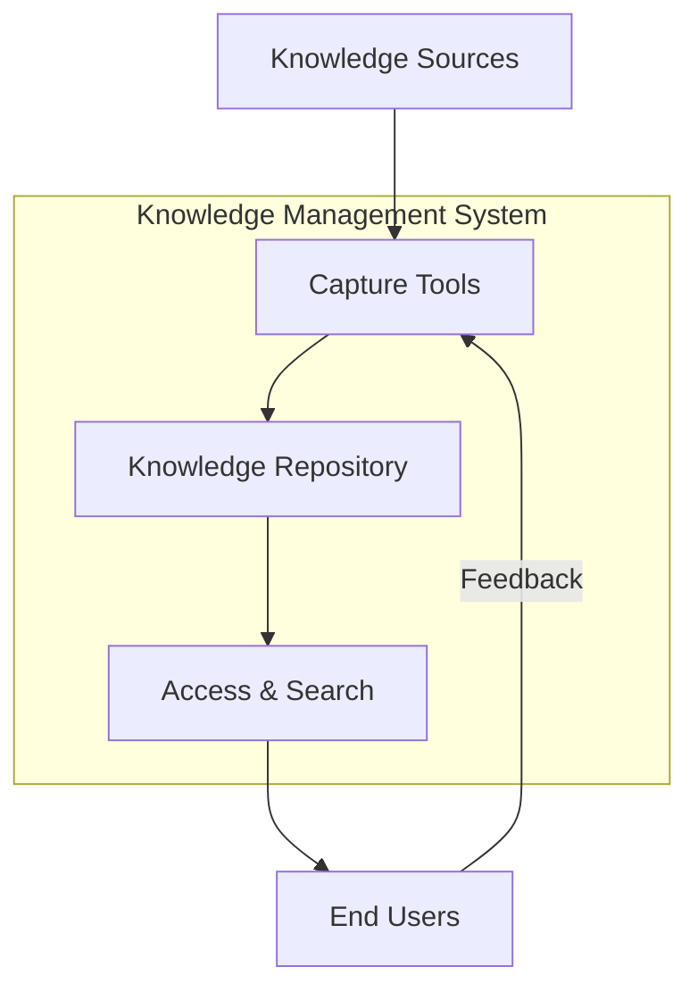

# Knowledge Management Strategy

## 1. Introduction

This Knowledge Management (KM) Strategy establishes a comprehensive framework for capturing, organizing, storing, and transferring critical knowledge across the nuclear facility's lifecycle. The strategy ensures that valuable information is preserved, accessible, and effectively utilized to support safe and reliable operations.

## 2. Knowledge Domains

### 2.1 Explicit Knowledge
- **Documentation**
  - Design basis documents
  - Operating procedures
  - Technical specifications
  - Safety analysis reports
  - Regulatory submissions

- **Records**
  - Operating experience
  - Event reports
  - Corrective actions
  - Maintenance history

### 2.2 Tacit Knowledge
- **Expertise**
  - System knowledge
  - Troubleshooting skills
  - Decision-making processes
  - Problem-solving approaches

- **Experience**
  - Lessons learned
  - Best practices
  - Workarounds
  - Historical context

## 3. Knowledge Capture

### 3.1 Methods

| Method | Description | Frequency | Owner |
|--------|-------------|-----------|-------|
| Interviews | Structured discussions with experts | Ongoing | KM Team |
| After-Action Reviews | Post-event analysis | Per event | Department Heads |
| Lessons Learned | Documenting experiences | Continuous | All Staff |
| Documentation Reviews | Updating procedures | Quarterly | Subject Matter Experts |
| Communities of Practice | Knowledge sharing groups | Monthly | KM Team |

### 3.2 Tools and Systems

| Tool | Purpose | Users |
|------|---------|-------|
| Document Management System | Centralized document storage | All Staff |
| Wiki/Intranet | Collaborative knowledge base | All Staff |
| Lessons Learned Database | Capturing operational experience | Operations, Maintenance |
| Video Library | Recording expert demonstrations | Training Department |
| Mentoring Platform | Connecting experts with learners | All Staff |

## 4. Knowledge Organization

### 4.1 Taxonomy

1. **By System**
   - Reactor Systems
   - Electrical Systems
   - Mechanical Systems
   - I&C Systems
   - Safety Systems

2. **By Function**
   - Operations
   - Maintenance
   - Engineering
   - Safety
   - Regulatory

3. **By Knowledge Type**
   - Procedures
   - Technical Specifications
   - Design Basis
   - Operating Experience
   - Training Materials

### 4.2 Metadata Standards

| Field | Description | Example |
|-------|-------------|---------|
| Title | Document title | Primary System Operating Procedure |
| Author | Original creator | John Smith |
| Date | Creation/Revision date | 2025-06-13 |
| Version | Document version | 3.2.1 |
| Keywords | Search terms | primary, cooling, procedure |
| Access Level | Security classification | Restricted |
| Related Docs | Linked documents | P&ID-001, TS-004 |

## 5. Knowledge Transfer

### 5.1 Methods

#### 5.1.1 Formal Training
- Classroom instruction
- Simulator training
- On-the-job training
- Computer-based training

#### 5.1.2 Mentoring Programs
- Senior-junior pairing
- Shadowing
- Apprenticeships
- Knowledge transfer sessions

#### 5.1.3 Communities of Practice
- Technical forums
- Working groups
- Special interest groups
- Lunch-and-learn sessions

### 5.2 Tools

| Tool | Purpose | Features |
|------|---------|----------|
| Learning Management System | Training delivery | Course tracking, certifications |
| Knowledge Base | Information repository | Search, version control |
| Collaboration Platform | Team communication | Chat, file sharing, video |
| Expert Directory | Finding subject matter experts | Skills inventory, availability |

## 6. Knowledge Preservation

### 6.1 Critical Knowledge Identification

| Knowledge Area | Criticality | Retention Period | Owner |
|----------------|-------------|------------------|-------|
| System Design Basis | High | Permanent | Engineering |
| Operating Procedures | High | 10 years | Operations |
| Maintenance History | Medium | Life of Plant | Maintenance |
| Training Materials | Medium | 5 years | Training |
| Event Reports | High | 10 years | Safety |

### 6.2 Knowledge Loss Risk Assessment

| Risk Factor | Impact | Likelihood | Mitigation |
|-------------|--------|------------|------------|
| Retirements | High | High | Succession planning |
| Organizational Changes | Medium | Medium | Knowledge mapping |
| Technology Changes | High | Medium | Documentation updates |
| Staff Turnover | Medium | High | Knowledge transfer programs |
| System Upgrades | High | Low | Impact analysis |

## 7. Technology Infrastructure

### 7.1 System Architecture

### 7.2 System Requirements

#### 7.2.1 Functional Requirements
- Full-text search
- Version control
- Access control
- Audit trail
- Mobile access
- Integration capabilities

#### 7.2.2 Non-Functional Requirements
- 99.9% availability
- <2 second search response
- 5-year data retention
- Daily backups
- Role-based access control

## 8. Implementation Roadmap

### 8.1 Phase 1: Foundation (0-6 months)
- Establish KM governance
- Deploy core systems
- Train KM champions
- Capture critical knowledge

### 8.2 Phase 2: Expansion (6-18 months)
- Expand knowledge capture
- Enhance search capabilities
- Implement communities of practice
- Measure effectiveness

### 8.3 Phase 3: Optimization (18-36 months)
- Advanced analytics
- AI/ML integration
- Continuous improvement
- Benchmarking

## 9. Metrics and Measurement

### 9.1 Key Performance Indicators

| KPI | Target | Measurement Method |
|-----|--------|-------------------|
| Knowledge Base Usage | 80% of staff monthly | System analytics |
| Search Success Rate | >90% | User feedback |
| Document Currency | <5% outdated | Review cycle |
| Knowledge Transfer | 100% of retirees | Completion records |
| User Satisfaction | >4/5 rating | Surveys |

### 9.2 Reporting

| Report | Frequency | Audience |
|--------|-----------|----------|
| System Usage | Monthly | KM Team |
| Content Gaps | Quarterly | Department Heads |
| User Feedback | Quarterly | Steering Committee |
| Program Effectiveness | Annually | Executive Team |

## 10. Governance

### 10.1 Roles and Responsibilities

| Role | Responsibilities |
|------|------------------|
| KM Steering Committee | Strategic direction, resource allocation |
| KM Manager | Program oversight, coordination |
| Department KM Leads | Domain-specific knowledge management |
| Content Owners | Content accuracy and currency |
| End Users | Knowledge contribution and utilization |

### 10.2 Policies and Standards
- Knowledge Management Policy
- Information Classification Standard
- Records Retention Policy
- Access Control Policy
- Change Management Process

## 11. Continuous Improvement

### 11.1 Evaluation Methods
- User feedback analysis
- System analytics
- Benchmarking
- Audits and assessments

### 11.2 Improvement Process
1. Identify opportunities
2. Analyze root causes
3. Develop solutions
4. Implement changes
5. Measure results
6. Standardize improvements
