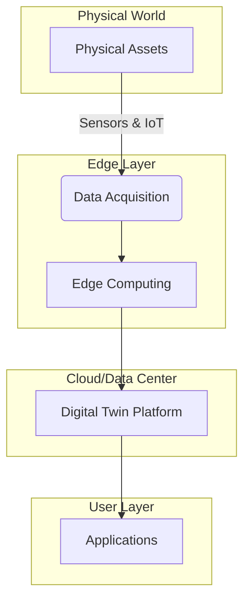
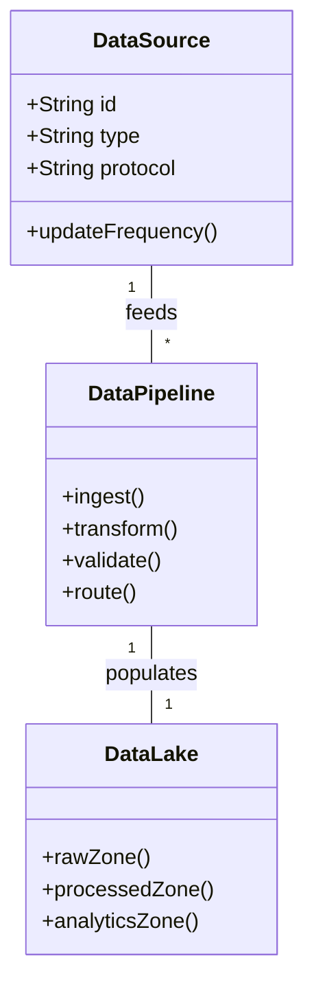

# Digital Twins Platform for Nuclear Facilities

## 1. Introduction

This document outlines the architecture, components, and implementation strategy for the Digital Twins Platform, enabling real-time monitoring, predictive analytics, and decision support for nuclear facility operations.

## 2. Platform Architecture

### 2.1 High-Level Architecture



### 2.2 Component Stack

| Layer | Components | Technologies |
|-------|------------|--------------|
| Physical | Sensors, Actuators, Equipment | Field devices, PLCs |
| Edge | Gateways, Edge Computing | IoT Edge, K3s |
| Connectivity | Protocols, APIs | OPC UA, MQTT, REST |
| Platform Core | Digital Twin Engine, Analytics | Python, Apache Kafka |
| Data | Storage, Processing | TimescaleDB, Apache Spark |
| Applications | Visualization, Analytics | Grafana, Custom Dashboards |
| Security | Authentication, Encryption | Keycloak, TLS 1.3 |

## 3. Digital Twin Components

### 3.1 Twin Types

| Twin Type | Purpose | Update Frequency | Data Sources |
|-----------|---------|------------------|--------------|
| Asset Twin | Equipment monitoring | Real-time | SCADA, IoT sensors |
| System Twin | System performance | Near real-time | Historian, MES |
| Process Twin | Process optimization | Minutes | ERP, MES, LIMS |
| Facility Twin | Plant-wide visualization | Hours | BIM, GIS, CAD |
| Cognitive Twin | Predictive analytics | Minutes | All sources + AI/ML |

### 3.2 Data Integration

| Data Source | Integration Method | Update Frequency | Data Volume |
|-------------|-------------------|------------------|-------------|
| SCADA | OPC UA | Real-time | High |
| Historian | ODBC, API | 1 min - 1 hour | Very High |
| CMMS | REST API | Daily | Medium |
| ERP | SOAP/REST | Daily | Low |
| Weather | Public APIs | Hourly | Low |
| Maintenance | Mobile Apps | Event-based | Low |

## 4. Implementation Strategy

### 4.1 Phased Implementation

#### Phase 1: Foundation (Months 1-6)
- Deploy edge infrastructure
- Implement core data pipeline
- Develop asset twins for critical equipment
- Basic visualization dashboards

#### Phase 2: Expansion (Months 7-18)
- Add system and process twins
- Implement predictive analytics
- Integrate with maintenance systems
- Advanced visualization

#### Phase 3: Optimization (Months 19-36)
- Deploy cognitive twins
- Implement AI/ML models
- Full plant digital twin
- Automated decision support

### 4.2 Technology Stack

| Component | Technology Options | Selection Criteria |
|-----------|-------------------|-------------------|
| Edge Computing | K3s, Azure IoT Edge, AWS Greengrass | Latency, Connectivity |
| Data Pipeline | Apache Kafka, Azure IoT Hub, AWS Kinesis | Throughput, Reliability |
| Time Series DB | TimescaleDB, InfluxDB, AWS Timestream | Query Performance, Scale |
| Analytics | Spark, Databricks, AWS EMR | Processing Power, ML Support |
| Visualization | Grafana, Power BI, Custom Web | Customization, Interactivity |
| AI/ML | TensorFlow, PyTorch, Azure ML | Model Complexity, Integration |

## 5. Data Management

### 5.1 Data Architecture



### 5.2 Data Quality Framework

| Dimension | Metric | Target | Measurement Method |
|-----------|--------|--------|-------------------|
| Completeness | % missing values | > 99% | Data profiling |
| Accuracy | % correct values | > 98% | Validation rules |
| Timeliness | Data latency | < 1s (critical) | Timestamp analysis |
| Consistency | % consistent records | > 99.5% | Cross-validation |
| Validity | % valid records | > 99% | Schema validation |

## 6. Analytics and AI/ML

### 6.1 Analytics Framework

| Layer | Purpose | Technologies |
|-------|---------|--------------|
| Descriptive | What happened? | SQL, BI Tools |
| Diagnostic | Why did it happen? | Statistical Analysis |
| Predictive | What will happen? | ML Models |
| Prescriptive | What should we do? | Optimization, Rules |
| Cognitive | How to improve? | Reinforcement Learning |

### 6.2 ML Model Catalog

| Model | Purpose | Inputs | Outputs | Refresh Frequency |
|-------|---------|--------|---------|------------------|
| Equipment Health | Failure prediction | Vibration, Temp, Pressure | RUL, Health Score | Daily |
| Energy Optimization | Load forecasting | Weather, Schedule, History | Energy Demand | Hourly |
| Anomaly Detection | Fault detection | Process Variables | Anomaly Score | Real-time |
| Process Optimization | Parameter tuning | Quality, Throughput | Optimal Parameters | Shift |
| Maintenance Planning | Work order prediction | Equipment History, Work Orders | Maintenance Schedule | Daily |

## 7. Visualization and User Interface

### 7.1 Dashboard Framework

| Dashboard | Purpose | Key Metrics | Update Frequency |
|-----------|---------|-------------|------------------|
| Operational | Real-time monitoring | KPIs, Alarms | Real-time |
| Performance | System health | OEE, Efficiency | 5 minutes |
| Maintenance | Equipment status | MTBF, MTTR | 15 minutes |
| Energy | Consumption | Usage, Cost | Hourly |
| Quality | Product metrics | Defect Rates | Hourly |

### 7.2 Visualization Components

| Component | Purpose | Technology | Interactivity |
|-----------|---------|------------|---------------|
| Process Flow | System overview | D3.js, Three.js | Pan, Zoom, Drill-down |
| Time Series | Trend analysis | Grafana, Plotly | Zoom, Compare |
| 3D Model | Spatial context | Unity, WebGL | Rotate, Inspect |
| Heatmaps | Anomaly detection | Custom, Mapbox | Filter, Select |
| Gauges | KPI monitoring | Canvas, SVG | Thresholds, Alerts |

## 8. Integration Framework

### 8.1 System Integration

| System | Integration Method | Data Flow | Security |
|--------|-------------------|-----------|----------|
| SCADA | OPC UA | Bi-directional | TLS, Certificate-based |
| MES | REST API | Bi-directional | OAuth 2.0 |
| CMMS | SOAP/REST | Bi-directional | API Keys |
| ERP | REST API | Scheduled | OAuth 2.0 |
| Document Management | GraphQL | On-demand | JWT |

### 8.2 API Design

```yaml
openapi: 3.0.0
info:
  title: Digital Twin API
  version: 1.0.0
  description: API for interacting with digital twin platform

paths:
  /api/v1/assets/{assetId}:
    get:
      summary: Get asset twin
      parameters:
        - $ref: '#/components/parameters/assetId'
      responses:
        '200':
          description: Asset twin data
          content:
            application/json:
              schema:
                $ref: '#/components/schemas/AssetTwin'
    
  /api/v1/assets/{assetId}/predictions:
    get:
      summary: Get predictions for asset
      parameters:
        - $ref: '#/components/parameters/assetId'
      responses:
        '200':
          description: Prediction results
          content:
            application/json:
              schema:
                $ref: '#/components/schemas/Prediction'

components:
  parameters:
    assetId:
      name: assetId
      in: path
      required: true
      schema:
        type: string
      description: Unique identifier of the asset

  schemas:
    AssetTwin:
      type: object
      properties:
        id:
          type: string
        name:
          type: string
        status:
          type: string
        lastUpdated:
          type: string
          format: date-time
        metrics:
          type: object
          additionalProperties: true
    
    Prediction:
      type: object
      properties:
        timestamp:
          type: string
          format: date-time
        predictions:
          type: array
          items:
            type: object
            properties:
              metric:
                type: string
              value:
                type: number
              confidence:
                type: number
```

## 9. Security and Compliance

### 9.1 Security Framework

| Domain | Controls | Implementation |
|--------|----------|----------------|
| Authentication | MFA, OAuth 2.0 | Keycloak, Azure AD |
| Authorization | RBAC, ABAC | Open Policy Agent |
| Encryption | TLS 1.3, AES-256 | OpenSSL, HSM |
| Audit | Logging, Monitoring | ELK Stack, SIEM |
| Data Protection | Masking, Tokenization | Vault, KMS |

### 9.2 Compliance Requirements

| Standard | Requirements | Implementation Status |
|----------|--------------|----------------------|
| NIST 800-53 | Access Control, Audit | In Progress |
| ISO 27001 | ISMS | Planned |
| NRC 5.71 | Cyber Security | In Progress |
| GDPR | Data Protection | Planned |
| NERC CIP | Critical Infrastructure | In Progress |

## 10. Deployment and Operations

### 10.1 Infrastructure Requirements

| Component | Specification | Quantity | HA |
|-----------|---------------|----------|----|
| Edge Nodes | 8 vCPU, 32GB RAM | 5 | Yes |
| Message Broker | 16 vCPU, 64GB RAM | 3 | Yes |
| Database | 32 vCPU, 128GB RAM | 2 | Yes |
| Application | 16 vCPU, 64GB RAM | 4 | Yes |
| Storage | 100TB NVMe | 2 | Yes |

### 10.2 Monitoring and Maintenance

| Component | Monitoring Tools | Alert Thresholds | Response Time |
|-----------|------------------|------------------|---------------|
| Infrastructure | Prometheus, Grafana | CPU > 80% | 15 min |
| Application | ELK, New Relic | Error rate > 1% | 5 min |
| Data Pipeline | Kafka Manager | Lag > 1000 ms | 5 min |
| Model Performance | MLflow, Seldon | Drift > 5% | 1 hour |
| Security | WAF, SIEM | Any critical | 5 min |

## 11. Case Studies

### 11.1 Reactor Coolant System Digital Twin
- **Objective**: Real-time monitoring and prediction
- **Components**: Pump health, thermal models
- **Results**: 30% reduction in unplanned downtime
- **Technologies**: ANSYS, Python, Kafka

### 11.2 Steam Generator Performance Optimization
- **Objective**: Efficiency improvement
- **Components**: Thermal models, fouling prediction
- **Results**: 2% increase in thermal efficiency
- **Technologies**: TensorFlow, Grafana

## 12. Future Roadmap

### 12.1 Short-term (0-12 months)
- Complete core platform deployment
- Implement critical asset twins
- Basic predictive maintenance
- Initial AI/ML models

### 12.2 Medium-term (12-24 months)
- Full plant coverage
- Advanced analytics
- Autonomous operations
- Integration with all systems

### 12.3 Long-term (24-36 months)
- Cognitive capabilities
- Self-optimizing systems
- Full digital thread
- Industry 4.0 integration
