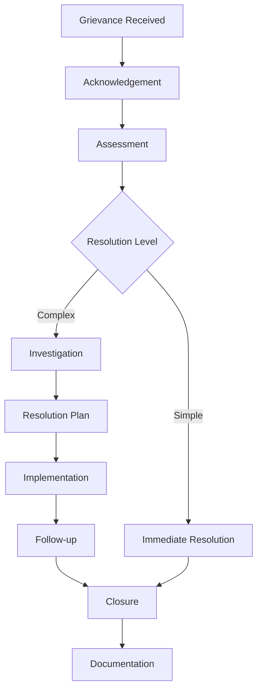

# Community Engagement & Transparency Framework

## 1. Executive Summary

This framework establishes a comprehensive approach to community engagement and transparency for the Nuklei project, ensuring open communication, stakeholder involvement, and public trust throughout the project lifecycle. The strategy is built on principles of inclusivity, accessibility, and proactive information sharing.

## 2. Core Principles

### 2.1 Foundational Values
- **Inclusivity**: Engage diverse stakeholders meaningfully
- **Transparency**: Share information openly and accessibly
- **Accountability**: Take responsibility for commitments
- **Responsiveness**: Address concerns promptly and thoroughly
- **Continuous Improvement**: Learn and adapt based on feedback

### 2.2 Strategic Objectives

| Objective | Key Performance Indicators | Target |
|-----------|---------------------------|--------|
| Build Trust | Public trust metrics | 80%+ positive |
| Increase Awareness | Website traffic, event attendance | 20% annual growth |
| Enhance Participation | Number of engaged stakeholders | 1000+ active |
| Improve Transparency | Transparency index score | 90%+ |
| Strengthen Relationships | Partner satisfaction | 85%+ satisfied |

## 3. Stakeholder Engagement

### 3.1 Stakeholder Mapping

| Stakeholder Group | Interest/Influence | Engagement Strategy |
|-------------------|---------------------|---------------------|
| Local Communities | High/High | Regular town halls, working groups |
| Regulatory Bodies | High/High | Formal consultations, compliance reporting |
| Industry Partners | High/Medium | Technical workshops, joint initiatives |
| Academic Institutions | Medium/Medium | Research collaborations, internships |
| General Public | Medium/Low | Public forums, educational programs |
| Media | Medium/High | Press briefings, media kits |
| NGOs | High/Medium | Dialogue sessions, partnership programs |

### 3.2 Engagement Methods

| Method | Frequency | Audience | Purpose |
|--------|-----------|----------|----------|
| Public Forums | Quarterly | General Public | Information sharing |
| Focus Groups | Bi-annually | Local Communities | In-depth feedback |
| Surveys | Annually | All Stakeholders | Broad input |
| Advisory Committees | Quarterly | Key Stakeholders | Strategic guidance |
| Site Visits | Annually | Community Leaders | Firsthand experience |
| Social Media | Daily | General Public | Updates and engagement |

## 4. Transparency Framework

### 4.1 Information Disclosure

| Information Type | Format | Update Frequency | Access Level |
|------------------|--------|------------------|--------------|
| Project Updates | Web, Email | Monthly | Public |
| Meeting Minutes | PDF, Web | Post-meeting | Public |
| Technical Reports | Web Portal | Quarterly | Public/Registered |
| Performance Data | Dashboard | Real-time | Public |
| Financial Reports | Web, PDF | Quarterly | Public |
| Incident Reports | Web, Email | As needed | Public |

### 4.2 Communication Channels

| Channel | Purpose | Update Frequency | Owner |
|---------|---------|------------------|-------|
| Project Website | General information | Continuous | Comms Team |
| Newsletter | Updates and news | Monthly | Comms Team |
| Social Media | Engagement | Daily | Comms Team |
| Public Meetings | Direct interaction | Quarterly | Project Team |
| Hotline | Concerns and questions | 24/7 | Ops Team |
| Email Alerts | Urgent updates | As needed | Comms Team |
| Mobile App | Real-time updates | Continuous | IT Team |

## 5. Community Programs

### 5.1 Education and Outreach

| Program | Target Audience | Frequency | Objectives |
|---------|-----------------|-----------|------------|
| School Visits | Students | Quarterly | STEM education |
| University Partnerships | Students, Faculty | Ongoing | Research collaboration |
| Public Lectures | General Public | Bi-annually | Knowledge sharing |
| Site Tours | Community Members | Quarterly | Transparency |
| Career Fairs | Job Seekers | Annually | Workforce development |
| Science Fairs | Students | Annually | STEM promotion |

### 5.2 Community Investment

| Initiative | Description | Budget | Impact |
|------------|-------------|--------|--------|
| Local Hiring | Priority for local workforce | 15% of hires | Economic development |
| Supplier Development | Support local businesses | $500k/year | Local economy |
| Infrastructure Projects | Community-identified needs | $2M over 5 years | Quality of life |
| Education Grants | STEM programs | $250k/year | Capacity building |
| Environmental Projects | Local conservation | $100k/year | Sustainability |

## 6. Grievance Mechanism

### 6.1 Reporting and Resolution Process

### 6.2 Performance Tracking

| Metric | Target | Current | Status |
|--------|--------|---------|--------|
| Resolution Time | 30 days | 25 days | On track |
| Satisfaction Rate | 90% | 87% | Improving |
| Recurrence Rate | <5% | 3.2% | On track |
| Reporting Channels | 5+ | 6 | Exceeded |
| Training Completion | 100% | 95% | In progress |

## 7. Implementation Roadmap

### 7.1 Short-term (0-6 months)
- Launch community liaison program
- Establish advisory committees
- Develop communication materials
- Conduct baseline survey
- Train staff on engagement protocols

### 7.2 Medium-term (6-18 months)
- Implement digital engagement platform
- Expand community programs
- Establish local partnerships
- Develop transparency dashboard
- Conduct impact assessments

### 7.3 Long-term (18-36 months)
- Full program implementation
- Continuous improvement process
- Knowledge sharing with industry
- Program evaluation and scaling

## 8. Monitoring and Evaluation

### 8.1 Performance Metrics

| Category | Indicator | Target | Measurement Method |
|----------|-----------|--------|-------------------|
| Engagement | Meeting attendance | 80%+ | Registration data |
| Transparency | Information requests | <10/month | Tracking system |
| Satisfaction | Survey results | 85%+ | Annual survey |
| Impact | Projects completed | 100% | Project tracking |
| Awareness | Website traffic | 20% growth | Analytics |

### 8.2 Reporting

| Report | Frequency | Audience | Distribution |
|--------|-----------|----------|--------------|
| Annual Report | Annually | Public | Web, Print |
| Quarterly Update | Quarterly | Stakeholders | Email, Web |
| Incident Report | As needed | Regulators, Public | Web, Email |
| Performance Dashboard | Monthly | Management | Internal |
| Grievance Report | Bi-annually | Public | Web, Print |

## 9. Resources and Budget

### 9.1 Resource Allocation

| Category | FTEs | Budget | Responsibilities |
|----------|------|--------|------------------|
| Community Relations | 5 | $750k | Engagement programs |
| Communications | 3 | $450k | Content creation |
| Administration | 2 | $300k | Coordination |
| Training | 1 | $150k | Capacity building |
| Technology | 2 | $400k | Digital platforms |
| Contingency | - | $250k | Unforeseen needs |
| **Total** | **13** | **$2.3M** | |

### 9.2 Key Performance Indicators

| KPI | Baseline | Target | Current | Status |
|-----|----------|--------|---------|--------|
| Community Satisfaction | 65% | 85% | 78% | Improving |
| Response Time | 7 days | 2 days | 3 days | On track |
| Engagement Rate | 20% | 50% | 42% | Progressing |
| Transparency Index | 60% | 90% | 75% | Improving |
| Program Reach | 5,000 | 15,000 | 11,200 | Progressing |

## 10. Appendices

### 10.1 Definitions
- **Stakeholder**: Any individual or group affected by or with an interest in the project
- **Grievance**: A formal complaint or concern raised by stakeholders
- **Engagement**: The process of involving stakeholders in decision-making
- **Transparency**: Openness in sharing project information and decisions
- **Impact**: The effect of project activities on stakeholders and environment

### 10.2 References
1. IFC Performance Standards
2. OECD Guidelines for Multinational Enterprises
3. UN Guiding Principles on Business and Human Rights
4. IAEA Safety Standards
5. GRI Sustainability Reporting Standards

### 10.3 Contact Information

| Role | Name | Email | Phone |
|------|------|-------|-------|
| Community Relations Manager | Jane Smith | j.smith@nuklei.com | +1-555-0100 |
| Communications Lead | John Doe | j.doe@nuklei.com | +1-555-0101 |
| Grievance Officer | Maria Garcia | m.garcia@nuklei.com | +1-555-0102 |
| Media Relations | Alex Chen | a.chen@nuklei.com | +1-555-0103 |
| General Inquiries | info@nuklei.com | | +1-800-NUKLEI1 |

---
*Last Updated: June 13, 2025*
