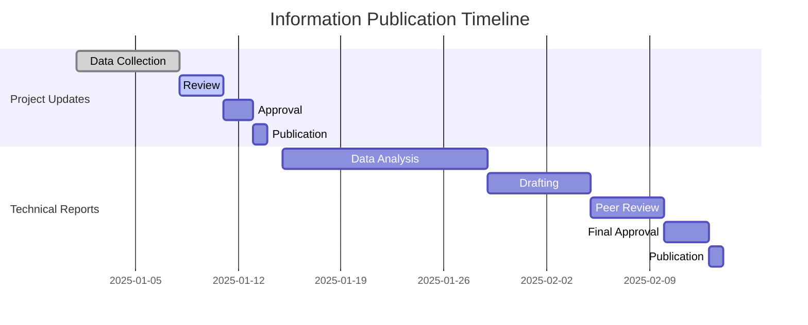
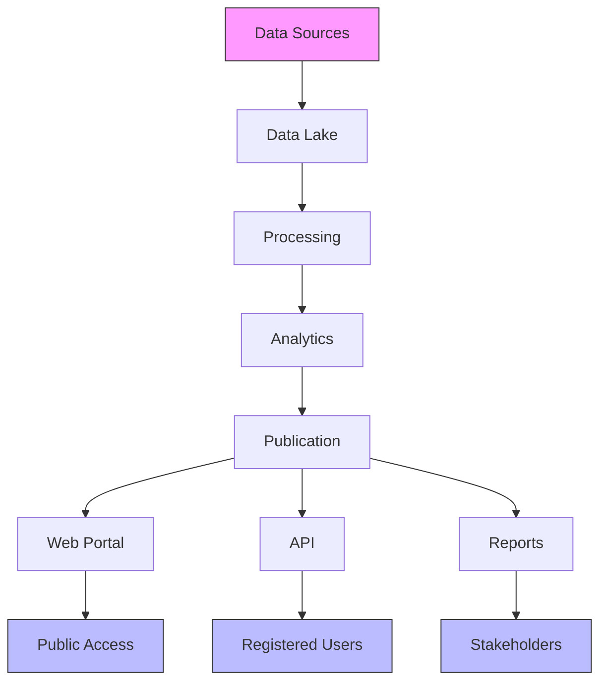

# Transparency Framework

## 1. Introduction

This document establishes the transparency framework for the Nuklei project, ensuring open, accessible, and timely disclosure of information to all stakeholders. The framework is designed to build trust, enable informed decision-making, and demonstrate accountability.

## 2. Guiding Principles

### 2.1 Core Principles

| Principle | Description | Implementation |
|-----------|-------------|-----------------|
| Proactive Disclosure | Share information without waiting for requests | Regular updates, public dashboards |
| Accessibility | Ensure information is easily accessible | Multiple formats, multiple languages |
| Accuracy | Provide correct and up-to-date information | Regular reviews, source verification |
| Completeness | Share comprehensive information | Full context, no misleading omissions |
| Timeliness | Disclose information promptly | Defined timeframes for different types of information |
| Understandability | Present information clearly | Plain language, visual aids |
| Relevance | Focus on material information | Stakeholder needs assessment |

### 2.2 Information Classification

| Classification | Description | Examples | Access |
|----------------|-------------|-----------|---------|
| Public | Non-sensitive, general information | Project updates, meeting minutes | Open access |
| Restricted | Sensitive but shareable with stakeholders | Technical reports, environmental data | Registered users |
| Confidential | Sensitive business or security information | Personal data, security plans | Limited access |
| Secret | Highly sensitive information | Trade secrets, critical infrastructure | Strictly controlled |

## 3. Information Disclosure

### 3.1 Disclosure Matrix

| Information Type | Format | Frequency | Audience | Owner |
|------------------|--------|-----------|----------|-------|
| Project Updates | Web, PDF | Monthly | Public | Comms |
| Meeting Minutes | PDF, Web | 5 days post-meeting | Public | Secretary |
| Technical Reports | PDF, Web | Quarterly | Registered | Technical |
| Financial Data | Web, PDF | Quarterly | Public | Finance |
| Environmental Data | Dashboard | Real-time | Public | EHS |
| Employment Data | Web, PDF | Annually | Public | HR |
| Incident Reports | Web, PDF | As needed | Public | Ops |
| Policies | Web, PDF | As updated | Public | Legal |

### 3.2 Publication Timeline

## 4. Data Management

### 4.1 Data Collection

| Data Type | Source | Collection Method | Frequency | Owner |
|-----------|--------|-------------------|-----------|-------|
| Environmental | Sensors, Samples | Automated, Manual | Continuous | EHS |
| Operational | SCADA, Logs | Automated | Real-time | Ops |
| Financial | ERP, Invoices | Manual, Auto-import | Monthly | Finance |
| Social | Surveys, Feedback | Online, In-person | Quarterly | Comms |
| Compliance | Audits, Inspections | Manual | As needed | Legal |

### 4.2 Data Quality Framework

| Dimension | Metric | Target | Measurement |
|-----------|--------|--------|-------------|
| Accuracy | % error-free records | >99% | Random sampling |
| Completeness | % complete fields | >98% | Data profiling |
| Timeliness | Time to publish | <24h | Process timing |
| Consistency | % consistent records | >99% | Cross-validation |
| Validity | % valid values | >99% | Rule checking |

## 5. Digital Platforms

### 5.1 Platform Architecture

### 5.2 Technology Stack

| Component | Technology | Purpose |
|-----------|------------|---------|
| Data Storage | Azure Data Lake | Raw data storage |
| Processing | Apache Spark | Data transformation |
| Database | PostgreSQL | Structured data |
| Time Series | TimescaleDB | Time-stamped data |
| Search | Elasticsearch | Full-text search |
| API | FastAPI | Data access |
| Frontend | React, D3.js | Data visualization |
| Hosting | Azure Kubernetes | Scalable deployment |

## 6. Access and Security

### 6.1 Access Control

| Level | Access | Authentication | Authorization |
|-------|--------|----------------|---------------|
| Public | Read-only | None | None |
| Registered | Basic read | Email/Password | Role-based |
| Partner | Enhanced read | MFA | Role-based |
| Staff | Read/Write | MFA, VPN | Role-based |
| Admin | Full access | MFA, VPN, IP restriction | Role-based |

### 6.2 Security Measures

| Control | Implementation | Purpose |
|---------|----------------|---------|
| Encryption | TLS 1.3, AES-256 | Data in transit/at rest |
| Authentication | OAuth 2.0, OIDC | User verification |
| Authorization | RBAC, ABAC | Access control |
| Audit | Comprehensive logging | Accountability |
| Backup | Geo-redundant storage | Data recovery |
| Monitoring | SIEM, IDS/IPS | Threat detection |

## 7. Performance Monitoring

### 7.1 Key Performance Indicators

| KPI | Target | Measurement | Frequency |
|-----|--------|-------------|-----------|
| Data Availability | 99.9% | Uptime monitoring | Real-time |
| Publication Timeliness | 95% on time | Schedule tracking | Monthly |
| Data Accuracy | >99% | Random sampling | Quarterly |
| User Satisfaction | >4/5 | Surveys | Bi-annually |
| API Response Time | <500ms | Performance monitoring | Continuous |
| Incident Response | <4 hours | Incident tracking | Per incident |

### 7.2 Reporting

| Report | Content | Frequency | Audience |
|--------|---------|-----------|----------|
| Monthly Status | Performance metrics | Monthly | Management |
| Quarterly Review | KPI analysis | Quarterly | Stakeholders |
| Annual Report | Comprehensive review | Annually | Public |
| Incident Report | Security incidents | As needed | Regulators |
| Compliance Report | Regulatory requirements | Annually | Authorities |

## 8. Continuous Improvement

### 8.1 Feedback Mechanisms

| Method | Description | Frequency | Owner |
|--------|-------------|-----------|-------|
| User Surveys | Online feedback form | Bi-annually | Comms |
| Focus Groups | In-depth discussions | Annually | Comms |
| Analytics | User behavior tracking | Continuous | IT |
| Suggestion Box | Open feedback | Continuous | Comms |
| Social Media | Public sentiment | Continuous | Comms |

### 8.2 Improvement Process

1. **Collect** feedback from all channels
2. **Analyze** data for trends and issues
3. **Prioritize** improvements based on impact
4. **Plan** implementation approach
5. **Implement** changes
6. **Verify** effectiveness
7. **Document** outcomes
8. **Communicate** results

## 9. Compliance and Standards

### 9.1 Regulatory Requirements

| Regulation | Requirements | Compliance Status | Next Review |
|------------|--------------|-------------------|-------------|
| NRC 10 CFR 50 | Nuclear safety | Compliant | 2025-12-31 |
| EPA NEPA | Environmental impact | In progress | 2025-06-30 |
| OSHA 29 CFR | Workplace safety | Compliant | 2025-12-31 |
| GDPR | Data protection | Compliant | 2025-05-15 |
| FOIA | Public records | Compliant | 2025-12-31 |

### 9.2 Industry Standards

| Standard | Description | Implementation Status |
|----------|-------------|------------------------|
| GRI | Sustainability reporting | Fully implemented |
| ISO 26000 | Social responsibility | Partially implemented |
| AA1000 | Stakeholder engagement | Fully implemented |
| IFC PS | Performance standards | In progress |
| UNGC | Global compact | Committed |

## 10. Appendices

### 10.1 Glossary

| Term | Definition |
|------|------------|
| API | Application Programming Interface |
| FOIA | Freedom of Information Act |
| MFA | Multi-Factor Authentication |
| RBAC | Role-Based Access Control |
| SIEM | Security Information and Event Management |
| VPN | Virtual Private Network |

### 10.2 References

1. [Open Government Partnership](https://www.opengovpartnership.org/)
2. [Global Reporting Initiative](https://www.globalreporting.org/)
3. [Extractive Industries Transparency Initiative](https://eiti.org/)
4. [Open Contracting Data Standard](https://standard.open-contracting.org/)
5. [International Open Data Charter](https://opendatacharter.net/)

### 10.3 Contact Information

| Role | Name | Email | Phone |
|------|------|-------|-------|
| Transparency Officer | Robert Taylor | r.taylor@nuklei.com | +1-555-0300 |
| Data Protection | Lisa Wong | l.wong@nuklei.com | +1-555-0301 |
| Webmaster | IT Support | webmaster@nuklei.com | +1-555-0302 |
| General Inquiries | info@nuklei.com | | +1-800-NUKLEI1 |

---
*Last Updated: June 13, 2025*
