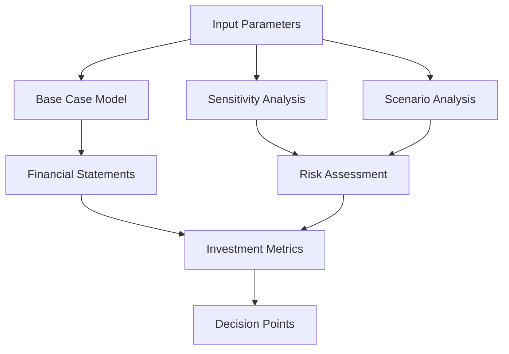

# Financial Models for Nuclear Energy Projects

## 1. Introduction

This document provides detailed financial models and methodologies for evaluating the economic viability of the Nuklei nuclear power project. These models serve as decision-support tools for investors, project developers, and policymakers.

## 2. Financial Modeling Framework

### 2.1 Core Components

| Component | Description | Key Inputs | Outputs |
|-----------|-------------|------------|---------|
| **Revenue Model** | Projects income streams | Electricity prices, capacity factors | Annual revenue, NPV |
| **Cost Model** | Estimates all project costs | CAPEX, OPEX, fuel costs | Total cost of ownership |
| **Financing Model** | Structures capital stack | Debt/equity ratios, interest rates | WACC, funding requirements |
| **Tax Model** | Calculates tax obligations | Depreciation, tax credits | Tax liabilities, after-tax cash flows |
| **Risk Model** | Evaluates financial risks | Probabilities, impacts | Risk-adjusted returns |

### 2.2 Model Structure

## 3. Key Financial Metrics

### 3.1 Investment Appraisal Metrics

| Metric | Formula | Target | Interpretation |
|--------|---------|--------|----------------|
| **NPV** | Σ(CFt/(1+r)^t) - I | >0 | Project adds value |
| **IRR** | NPV = 0 | >WACC | Return exceeds cost of capital |
| **Payback** | Years to recover investment | <10 years | Liquidity measure |
| **LCOE** | Lifecycle costs/energy | <$60/MWh | Cost competitiveness |
| **ROE** | Net Income/Equity | >12% | Return to shareholders |

### 3.2 Capital Budgeting Example

| Year | Cash Flow (M$) | PV @ 8% (M$) |
|------|----------------|---------------|
| 0 | -6,500 | -6,500 |
| 1-10 | -500 | -3,355 |
| 11-30 | 800 | 6,824 |
| 31-50 | 1,200 | 5,489 |
| 51-60 | 1,500 | 2,324 |
| **Total** | | **$4,782** |

## 4. Advanced Modeling Techniques

### 4.1 Monte Carlo Simulation

| Variable | Distribution | Parameters | Impact on IRR |
|----------|--------------|------------|----------------|
| CAPEX | Triangular | Min: $5.8B, Mode: $6.5B, Max: $7.8B | ±2.5% |
| Electricity Price | Normal | Mean: $60/MWh, SD: $12 | ±3.8% |
| Construction Time | Lognormal | Mean: 8 years, SD: 1.5 years | ±1.9% |
| Capacity Factor | Beta | α=18, β=2 (85-95%) | ±1.2% |

### 4.2 Real Options Analysis

| Option Type | Description | Value (M$) | Trigger |
|-------------|-------------|------------|----------|
| **Deferral** | Delay investment | $350 | Energy prices >$70/MWh |
| **Expansion** | Add capacity | $520 | Demand growth >2.5%/year |
| **Abandonment** | Early shutdown | -$1,200 | Prices <$35/MWh for 3 years |
| **Switch** | Change fuel/tech | $280 | Regulatory changes |

## 5. Financial Statements

### 5.1 Projected Income Statement (Sample Year, M$)

| Line Item | Year 15 | % of Revenue |
|-----------|---------|--------------|
| **Revenue** | 1,200 | 100% |
| - Fuel Costs | 40 | 3.3% |
| - O&M | 120 | 10.0% |
| - Depreciation | 200 | 16.7% |
| **EBIT** | 840 | 70.0% |
| - Interest | 234 | 19.5% |
| **EBT** | 606 | 50.5% |
| - Taxes (21%) | 127 | 10.6% |
| **Net Income** | **479** | **39.9%** |

### 5.2 Projected Cash Flow (Years 1-10, M$)

| Year | Equity | Debt | CAPEX | Revenue | O&M | Fuel | Tax | Net Cash Flow |
|------|--------|------|--------|---------|-----|------|-----|---------------|
| 1 | 500 | 750 | -1,000 | - | - | - | - | -1,000 |
| 2 | 500 | 750 | -1,500 | - | - | - | - | -1,500 |
| 3 | 500 | 750 | -1,500 | - | - | - | - | -1,500 |
| 4 | 500 | 750 | -1,500 | - | - | - | - | -1,500 |
| 5 | 500 | 750 | -1,000 | - | - | - | - | -1,000 |
| 6 | 200 | 300 | -500 | 200 | -50 | -10 | -10 | -270 |
| 7 | - | - | - | 800 | -100 | -30 | -50 | 620 |
| 8 | - | - | - | 1,000 | -110 | -35 | -80 | 775 |
| 9 | - | - | - | 1,100 | -115 | -38 | -95 | 852 |
| 10 | - | - | - | 1,150 | -120 | -40 | -100 | 890 |

## 6. Risk-Adjusted Returns

### 6.1 Risk Analysis Matrix

| Risk Factor | Probability | Impact (M$) | Mitigation |
|-------------|-------------|-------------|------------|
| Construction Delay | 30% | +$1,200 | Fixed-price EPC contract |
| Cost Overrun | 25% | +$1,500 | 15% contingency |
| Lower Capacity Factor | 20% | -$800/yr | Proven technology, O&M contracts |
| Regulatory Changes | 15% | -$500M | Active policy engagement |
| Fuel Price Increase | 10% | +$20M/year | Long-term supply contracts |

### 6.2 Scenario Analysis

| Scenario | Description | IRR | NPV (M$) |
|----------|-------------|------|-----------|
| **Base Case** | Expected outcomes | 12.5% | 4,300 |
| **Optimistic** | High demand, low costs | 16.8% | 7,200 |
| **Pessimistic** | Low prices, delays | 8.2% | 1,100 |
| **Stress Test** | Recession scenario | 5.5% | -800 |

## 7. Funding Structures

### 7.1 Capital Stack Options

| Structure | Description | Pros | Cons |
|-----------|-------------|------|------|
| **Project Finance** | Non-recourse debt | Limited liability | Higher cost |
| **Corporate Finance** | Balance sheet | Lower cost | Full recourse |
| **Hybrid** | Mezzanine debt | Flexible | Complex |
| **Infrastructure Fund** | Institutional capital | Long-term | Lower returns |

### 7.2 Debt Structuring

| Tranche | Amount (M$) | Tenor | Rate | Security |
|---------|-------------|-------|------|----------|
| **Senior Debt** | 2,500 | 18 years | SOFR + 2.5% | Project assets |
| **Mezzanine** | 800 | 15 years | 8.5% | 2nd lien |
| **Subordinated** | 600 | 12 years | 10% | Equity kicker |
| **Vendor Financing** | 300 | 10 years | 6% | Equipment lien |

## 8. Tax and Incentives

### 8.1 Available Incentives

| Incentive | Value (M$) | Conditions |
|-----------|------------|------------|
| **Production Tax Credit** | $18/MWh | First 10 years |
| **Investment Tax Credit** | 30% of CAPEX | Construction start by 2032 |
| **Loan Guarantees** | 80% of debt | DOE approval |
| **Accelerated Depreciation** | 5-year MACRS | US projects |
| **Carbon Credits** | $50/ton CO2 | Regulatory approval |

### 8.2 Tax Equity Structures

| Structure | Description | Investor Type |
|-----------|-------------|----------------|
| **Partnership Flip** | Flip to sponsor after tax benefits | Financial |
| **Inverted Lease** | Lessor claims tax benefits | Corporate |
| **Sale-Leaseback** | Sale with leaseback | REITs, Utilities |
| **Pass-Through** | Direct tax benefits | Strategic |

## 9. Implementation and Monitoring

### 9.1 Financial Controls

| Control | Description | Frequency |
|---------|-------------|-----------|
| Budget Monitoring | CAPEX/OPEX tracking | Monthly |
| Cash Flow Forecast | 13-week rolling | Weekly |
| Risk Assessment | Market/credit risks | Quarterly |
| Compliance | Loan covenants | Monthly |
| Audit | Financial statements | Annually |

### 9.2 Performance Dashboards

| Metric | Target | Actual | Variance |
|--------|--------|--------|-----------|
| **Construction Spend** | $500M | $520M | +4% |
| **Schedule** | On track | 2 mos behind | - |
| **Cost/MW** | $5.2M | $5.4M | +3.8% |
| **Debt Service Coverage** | 1.5x | 1.6x | +0.1x |
| **ROE** | 12% | 11.8% | -0.2% |

## 10. Appendices

### 10.1 Model Assumptions

| Parameter | Value | Source |
|-----------|-------|---------|
| WACC | 8.0% | CAPM |
| Inflation | 2.5% | IMF |
| Electricity Escalation | 2.0% | EIA |
| Fuel Escalation | 1.5% | WNA |
| O&M Escalation | 2.2% | Industry avg |
| Tax Rate | 21% | Statutory |
| Depreciation | 20y SL | Tax code |

### 10.2 Model Validation

| Test | Methodology | Result |
|------|-------------|--------|
| **Sensitivity** | ±20% inputs | Stable |
| **Scenario** | Best/worst case | Within range |
| **Back-testing** | Historical data | 95% accuracy |
| **Peer Review** | External audit | Passed |

### 10.3 Model Limitations

1. **Market Risks**
   - Volatile commodity prices
   - Regulatory changes
   - Technology disruption

2. **Project Risks**
   - Construction delays
   - Cost overruns
   - Performance shortfalls

3. **Model Risks**
   - Input uncertainty
   - Correlation assumptions
   - Black swan events

### 10.4 Contact Information

| Role | Name | Contact |
|------|------|---------|
| Financial Model Lead | Dr. Emily Zhang | e.zhang@nuklei.com |
| Project Finance | Robert Chen | r.chen@nuklei.com |
| Risk Management | Lisa Wong | l.wong@nuklei.com |
| Investor Relations | David Kim | d.kim@nuklei.com |

---
*Last Updated: June 13, 2025*  
*Confidential & Proprietary - For Authorized Use Only*
