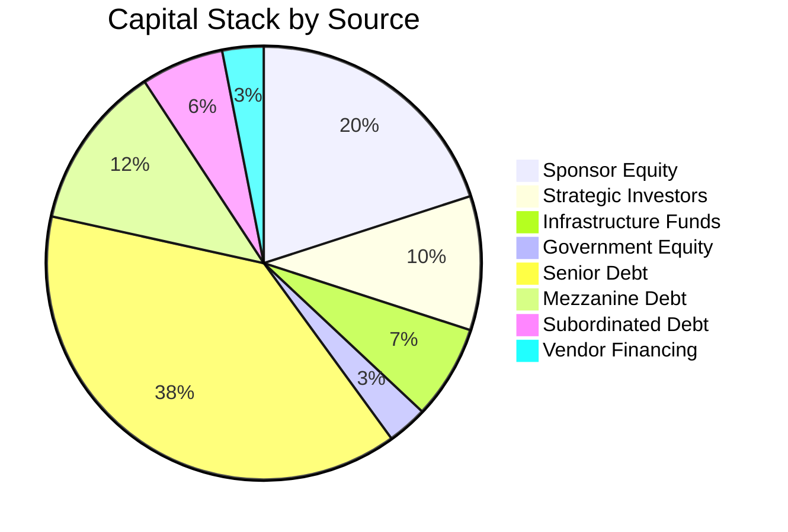

# Funding Sources and Capital Structure

## 1. Executive Summary

This document outlines the comprehensive funding strategy for the Nuklei nuclear power project, detailing all potential funding sources, capital structure optimization, and financial instruments to ensure successful project financing. The strategy balances risk, cost of capital, and financial sustainability throughout the project lifecycle.

## 2. Capital Structure

### 2.1 Target Capital Structure

| Component | Amount (M$) | % of Total | Target Returns |
|-----------|-------------|------------|----------------|
| **Equity** | 2,600 | 40% | 15-18% IRR |
| - Sponsor Equity | 1,300 | 20% | 15% |
| - Strategic Investors | 650 | 10% | 16% |
| - Infrastructure Funds | 455 | 7% | 14% |
| - Government Equity | 195 | 3% | 8% |
| **Debt** | 3,900 | 60% | 6-8% p.a. |
| - Senior Debt | 2,500 | 38.5% | SOFR + 250bps |
| - Mezzanine Debt | 800 | 12.3% | 8.5% fixed |
| - Subordinated Debt | 400 | 6.2% | 10% PIK |
| - Vendor Financing | 200 | 3.0% | 7% |
| **Total** | **6,500** | **100%** | **9.2% WACC** |

### 2.2 Capital Stack by Source

## 3. Equity Financing

### 3.1 Equity Investor Profile

| Investor Type | Target Share | Investment Horizon | Risk Appetite | Key Terms |
|--------------|--------------|-------------------|---------------|------------|
| **Utilities** | 35% | 20+ years | Medium | Strategic partnership |
| **Infrastructure Funds** | 25% | 10-15 years | Medium | Stable cash flows |
| **Sovereign Wealth** | 20% | 15-20 years | Low | Government backing |
| **Pension Funds** | 15% | 20+ years | Low | Inflation protection |
| **Industrial Partners** | 5% | Indefinite | High | Technology access |

### 3.2 Equity Commitment Schedule

| Tranche | Amount (M$) | Timing | Milestone | Conditions Precedent |
|---------|-------------|--------|------------|----------------------|
| **Tranche 1** | 650 | Financial Close | Final Investment Decision | Permits, PPAs |
| **Tranche 2** | 650 | Year 1 | 25% Construction | Progress certification |
| **Tranche 3** | 650 | Year 3 | 50% Construction | Debt drawdown |
| **Tranche 4** | 650 | Year 5 | 75% Construction | Performance tests |

## 4. Debt Financing

### 4.1 Debt Instruments

| Instrument | Amount (M$) | Tenor | Interest Rate | Security |
|------------|-------------|-------|---------------|----------|
| **Senior Term Loan A** | 1,500 | 18 years | SOFR + 2.5% | 1st lien |
| **Senior Term Loan B** | 1,000 | 15 years | SOFR + 3.5% | 1st lien |
| **Mezzanine Loan** | 800 | 12 years | 8.5% fixed | 2nd lien |
| **Subordinated Debt** | 400 | 10 years | 10% PIK | Equity pledge |
| **Vendor Financing** | 200 | 8 years | 7.0% | Equipment |
| **Total** | **3,900** | | | |

### 4.2 Debt Service Profile

| Year | Principal (M$) | Interest (M$) | Total (M$) | DSCR |
|------|----------------|----------------|------------|------|
| 1-5 | 0 | 234 | 234 | N/A |
| 6 | 130 | 234 | 364 | 1.05 |
| 7 | 143 | 221 | 364 | 1.10 |
| 8 | 157 | 207 | 364 | 1.15 |
| 9 | 173 | 191 | 364 | 1.20 |
| 10 | 190 | 174 | 364 | 1.25 |
| 11-18 | 2,108 | 1,000 | 3,108 | >1.30 |
| **Total** | **2,900** | **2,461** | **5,361** | |

## 5. Government and Multilateral Support

### 5.1 Loan Guarantees

| Agency | Amount (M$) | Coverage | Tenor | Fee |
|--------|-------------|-----------|-------|-----|
| **US DOE** | 2,000 | 80% | 30y | 1.5% |
| **UKEF** | 1,000 | 70% | 20y | 2.0% |
| **JBIC** | 500 | 60% | 15y | 1.8% |
| **Total** | **3,500** | | | |

### 5.2 Grants and Subsidies

| Program | Type | Amount (M$) | Conditions |
|---------|------|-------------|------------|
| **DOE ATVM** | Loan guarantee | 2,000 | US content >50% |
| **EU Innovation Fund** | Grant | 500 | Carbon reduction |
| **Green Bonds** | Tax credit | 300 | Environmental benefits |
| **State Incentives** | Tax abatement | 200 | Job creation |
| **Total** | | **3,000** | |

## 6. Risk Allocation and Mitigation

### 6.1 Risk Allocation Matrix

| Risk | Party | Mitigation |
|------|-------|------------|
| **Construction** | Contractor | Fixed-price EPC, performance bonds |
| **Technology** | Vendor | Performance guarantees, liquidated damages |
| **Market** | Offtaker | Take-or-pay PPA, price escalations |
| **Regulatory** | Project Co | Permitting support, change in law |
| **Force Majeure** | Insurers | Comprehensive insurance coverage |
| **Fuel Price** | Supplier | Long-term fixed-price contracts |

### 6.2 Credit Enhancements

| Enhancement | Provider | Benefit |
|-------------|----------|---------|
| **Completion Guarantee** | Sponsors | Covers cost overruns |
| **Debt Service Reserve** | Lenders | 6 months coverage |
| **Maintenance Reserve** | Project | 3% of OPEX |
| **Liquidity Facility** | Banks | $200M revolving |
| **Hedging** | Banks | Interest rate, FX |

## 7. Financial Close Process

### 7.1 Key Milestones

| Milestone | Timeline | Responsible Party |
|-----------|----------|-------------------|
| **Term Sheet Execution** | M0 | All parties |
| **Due Diligence Completion** | M3 | Lenders' advisors |
| **Credit Approval** | M5 | Lenders |
| **Documentation** | M7 | Legal teams |
| **Conditions Precedent** | M9 | Project Co |
| **Financial Close** | M10 | All parties |

### 7.2 Conditions Precedent

1. **Legal**
   - Project agreements executed
   - Permits and consents obtained
   - Security package perfected

2. **Financial**
   - Equity commitment letters
   - Debt commitment letters
   - Financial model approved

3. **Technical**
   - EPC contract in place
   - O&M agreements signed
   - Fuel supply secured

4. **Commercial**
   - PPAs executed
   - Grid connection agreement
   - Insurance in place

## 8. Exit Strategies

### 8.1 Equity Exit Options

| Option | Timeline | Expected Multiple | Pros | Cons |
|--------|----------|-------------------|------|------|
| **IPO** | Year 10 | 12-15x EBITDA | High valuation | Regulatory burden |
| **Trade Sale** | Year 8 | 10-12x EBITDA | Strategic premium | Limited buyers |
| **Secondary Buyout** | Year 7 | 9-11x EBITDA | Quick execution | Lower valuation |
| **Infrastructure Fund** | Year 5 | 8-10x EBITDA | Early liquidity | Lower returns |
| **YieldCo** | Year 6 | 10-12x EBITDA | Tax efficient | Market conditions |

### 8.2 Debt Refinancing

| Option | Timing | Benefits | Risks |
|--------|--------|----------|-------|
| **Take-out Financing** | COD + 2y | Lower rates | Prepayment penalties |
| **Project Bonds** | Year 5 | Longer tenors | Market access |
| **Green Bonds** | Year 3 | Lower cost | Use of proceeds |
| **Infra Debt Funds** | Year 4 | Flexible terms | Higher cost |

## 9. Case Studies

### 9.1 Comparable Project Financings

| Project | Location | Size (MW) | Total Cost (B$) | Debt/Equity | Key Features |
|---------|----------|-----------|-----------------|-------------|--------------|
| **Hinkley Point C** | UK | 3,200 | 26.0 | 70/30 | CfD, UK Guarantees |
| **Barakah** | UAE | 5,380 | 24.4 | 80/20 | Export credits, SWF |
| **Vogtle** | USA | 2,234 | 28.0 | 60/40 | Loan guarantees, PTC |
| **Olkiluoto 3** | Finland | 1,600 | 11.0 | 60/40 | Mankala model |
| **Nuklei** | TBD | 1,200 | 6.5 | 60/40 | This project |

### 9.2 Lessons Learned

1. **Structuring**
   - Align debt tenor with asset life
   - Match currency of revenue and debt
   - Maintain reserve accounts

2. **Risk Management**
   - Fixed-price EPC critical
   - Long-term fuel contracts
   - Interest rate hedging

3. **Stakeholder Alignment**
   - Clear decision rights
   - Regular reporting
   - Dispute resolution mechanisms

## 10. Appendices

### 10.1 Financial Model Outputs

| Scenario | Equity IRR | Project IRR | DSCR | Loan Life |
|----------|------------|-------------|------|-----------|
| **Base Case** | 15.2% | 8.7% | 1.35x | 1.25x |
| **Upside** | 18.5% | 10.2% | 1.50x | 1.40x |
| **Downside** | 12.1% | 7.5% | 1.20x | 1.10x |
| **Stress Test** | 8.9% | 5.5% | 1.05x | 0.95x |

### 10.2 Legal Documentation

1. **Loan Agreement**
   - Terms and conditions
   - Covenants
   - Events of default

2. **Security Documents**
   - Share pledge
   - Account security
   - Direct agreements

3. **Project Agreements**
   - EPC Contract
   - O&M Agreement
   - PPA
   - Fuel Supply Agreement

### 10.3 Investor Presentation

1. **Investment Highlights**
   - Strong sponsor team
   - Proven technology
   - Long-term off-take
   - Attractive returns

2. **Financial Summary**
   - Projected returns
   - Cash flow profile
   - Sensitivity analysis

3. **Risk Factors**
   - Construction risk
   - Market risk
   - Regulatory risk

### 10.4 Contact Information

| Role | Name | Organization | Contact |
|------|------|--------------|---------|
| Project Finance Director | Sarah Johnson | Nuklei Energy | s.johnson@nuklei.com |
| Investment Relations | David Kim | Nuklei Energy | d.kim@nuklei.com |
| Lead Arranger | James Wilson | Global Bank | j.wilson@globalbank.com |
| Legal Counsel | Emily Chen | Law Partners | e.chen@lawpartners.com |
| Technical Advisor | Dr. Robert Taylor | Nuclear Advisors | r.taylor@nuclear-advisors.com |

---
*Last Updated: June 13, 2025*  
*Confidential & Proprietary - For Investor Use Only*
