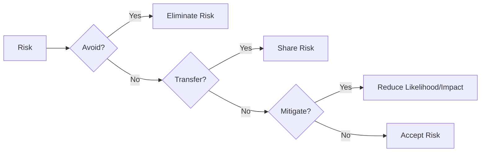
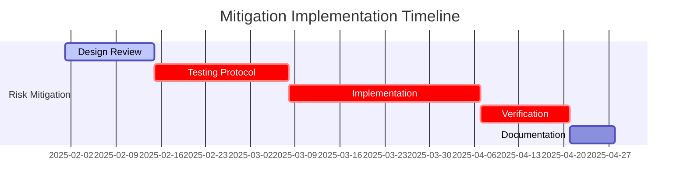
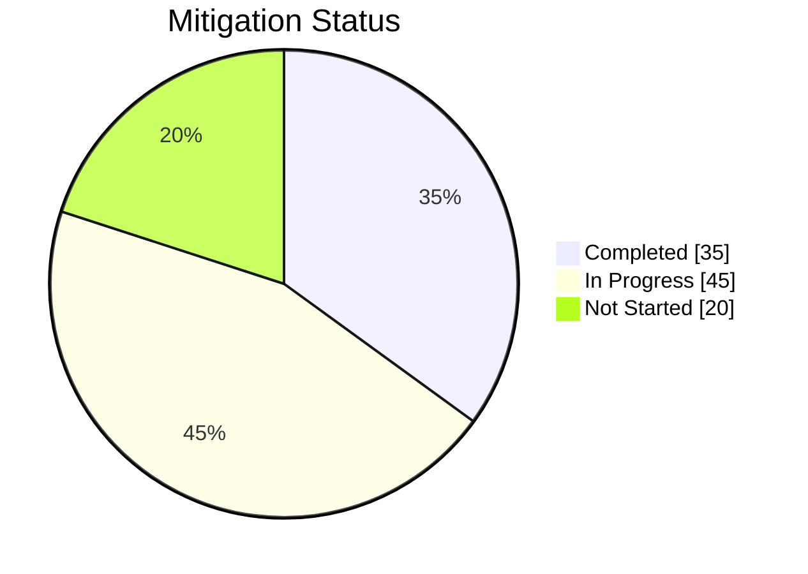

# Risk Mitigation Strategies

## Table of Contents
1. [Introduction](#1-introduction)
2. [Mitigation Framework](#2-mitigation-framework)
3. [Strategy Selection](#3-strategy-selection)
4. [Implementation Planning](#4-implementation-planning)
5. [Effectiveness Monitoring](#5-effectiveness-monitoring)
6. [Case Studies](#6-case-studies)
7. [Tools & Templates](#7-tools--templates)
8. [Appendices](#8-appendices)

## 1. Introduction

This document outlines comprehensive mitigation strategies for addressing risks identified in the Nuklei project. It provides a structured approach to developing and implementing effective risk responses.

### 1.1 Purpose
- Guide the development of targeted mitigation actions
- Ensure consistent approach to risk treatment
- Support decision-making for risk response
- Document lessons learned for continuous improvement

### 1.2 Key Principles
- **Proactive**: Address risks before they become issues
- **Proportionate**: Scale response to risk level
- **Practical**: Implementable within project constraints
- **Proven**: Based on industry best practices

## 2. Mitigation Framework

### 2.1 Risk Treatment Options



### 2.2 Strategy Selection Matrix

| Strategy | When to Use | Pros | Cons | Example |
|----------|-------------|------|------|----------|
| **Avoid** | Risk is unacceptable | Eliminates threat | May limit opportunities | Change project scope |
| **Transfer** | Third party better manages risk | Reduces liability | May be costly | Insurance, contracts |
| **Mitigate** | Risk can be reduced | Reduces probability/impact | Requires resources | Redundant systems |
| **Accept** | Risk is minor | Cost-effective | Potential impact remains | Contingency planning |

## 3. Strategy Selection

### 3.1 Technical Risks

#### 3.1.1 Design Flaws
- **Prevention**:
  - Peer reviews
  - Prototype testing
  - Independent verification
- **Contingency**:
  - Design modifications
  - Alternative solutions
  - Temporary workarounds

#### 3.1.2 Technology Maturity
- **Prevention**:
  - Technology readiness assessment
  - Vendor qualification
  - Pilot testing
- **Contingency**:
  - Fallback technologies
  - Parallel development
  - Additional testing

### 3.2 Project Management Risks

#### 3.2.1 Schedule Delays
- **Prevention**:
  - Critical path analysis
  - Buffer management
  - Resource leveling
- **Contingency**:
  - Schedule compression
  - Fast-tracking
  - Additional shifts

#### 3.2.2 Cost Overruns
- **Prevention**:
  - Detailed cost estimation
  - Contingency reserves
  - Regular cost monitoring
- **Contingency**:
  - Value engineering
  - Scope adjustment
  - Additional funding

### 3.3 Safety & Environmental Risks

#### 3.3.1 Radiation Safety
- **Prevention**:
  - ALARA principles
  - Shielding design
  - Access controls
- **Contingency**:
  - Emergency procedures
  - Decontamination
  - Medical response

#### 3.3.2 Environmental Impact
- **Prevention**:
  - Environmental impact assessment
  - Pollution prevention
  - Waste minimization
- **Contingency**:
  - Spill response
  - Remediation plans
  - Regulatory reporting

## 4. Implementation Planning

### 4.1 Action Plan Template

| Action Item | Owner | Start Date | Due Date | Status | Resources | Dependencies |
|-------------|-------|------------|----------|--------|-----------|--------------|
 | Develop test protocol | QA Lead | 2025-02-01 | 2025-02-15 | Not Started | Test team, Equipment | Test plan approval |
 | Conduct safety review | Safety Officer | 2025-02-10 | 2025-02-28 | Planned | Safety team | Design freeze |
 | Update procedures | Process Engineer | 2025-02-15 | 2025-03-01 | Not Started | Documentation team | Review completion |

### 4.2 Resource Allocation



## 5. Effectiveness Monitoring

### 5.1 Key Performance Indicators

| KPI | Target | Current | Status |
|-----|--------|---------|--------|
| Risk reduction % | ≥80% | 65% | Below Target |
| Mitigation completion | 100% | 75% | On Track |
| Residual risk level | ≤Medium | High | Attention Needed |
| Implementation cost | ≤Budget | 85% of budget | On Track |

### 5.2 Monitoring Dashboard



## 6. Case Studies

### 6.1 Successful Mitigation: Supply Chain Disruption

**Challenge**: Critical component delivery delay (8 weeks)

**Actions Taken**:
1. Activated secondary supplier
2. Air freight expedited
3. Temporary workaround implemented

**Results**:
- 2-week delay (vs. 8 weeks)
- 15% cost increase (vs. 40% potential)
- No impact on critical path

### 6.2 Lessons Learned: Regulatory Compliance

**Issue**: New regulatory requirement identified late

**Root Cause**:
- Incomplete regulatory monitoring
- Lack of stakeholder engagement

**Improvements**:
- Established regulatory watch program
- Quarterly compliance reviews
- Early regulator consultation

## 7. Tools & Templates

### 7.1 Risk Mitigation Plan Template

```markdown
# Risk Mitigation Plan: [Risk ID]

## 1. Risk Description
- **Risk Statement**: [Clear description]
- **Category**: [Technical/Schedule/Cost/etc.]
- **Impact**: [Description of potential impact]
- **Probability**: [High/Medium/Low]
- **Risk Score**: [1-25]

## 2. Mitigation Strategy
- **Approach**: [Avoid/Transfer/Mitigate/Accept]
- **Actions**: [Detailed steps]
- **Owner**: [Name/Position]
- **Timeline**: [Start/End dates]
- **Resources**: [Required resources]

## 3. Implementation Plan
- **Milestones**: [Key dates]
- **Dependencies**: [Prerequisites]
- **Constraints**: [Limitations]

## 4. Monitoring & Control
- **KPIs**: [Measurable indicators]
- **Reporting**: [Frequency and format]
- **Review**: [Scheduled reviews]

## 5. Contingency Plan
- **Trigger Events**: [When to activate]
- **Actions**: [Contingency steps]
- **Owner**: [Responsible party]
- **Resources**: [Required resources]
```

### 7.2 Risk Response Matrix

| Risk Level | Recommended Actions | Approval Required |
|------------|---------------------|-------------------|
| **Extreme** | Immediate action, Executive oversight | CEO/Board |
| **High** | Aggressive mitigation, Senior management review | Department Head |
| **Medium** | Standard mitigation, Regular monitoring | Project Manager |
| **Low** | Routine procedures, Periodic review | Team Lead |

## 8. Appendices

### 8.1 Glossary
- **Mitigation**: Actions to reduce probability/impact
- **Contingency**: Planned responses if risk occurs
- **Trigger**: Event indicating risk is about to occur
- **Residual Risk**: Remaining risk after mitigation

### 8.2 References
- ISO 31000:2018 Risk Management
- PMBOK Guide 7th Edition
- IAEA Safety Standards
- NRC Regulatory Guides

### 8.3 Document History

| Version | Date | Author | Changes |
|---------|------|--------|----------|
| 1.0 | 2025-06-13 | Nuklei Team | Initial version |
| 1.1 | 2025-06-20 | Risk Team | Added case studies |
