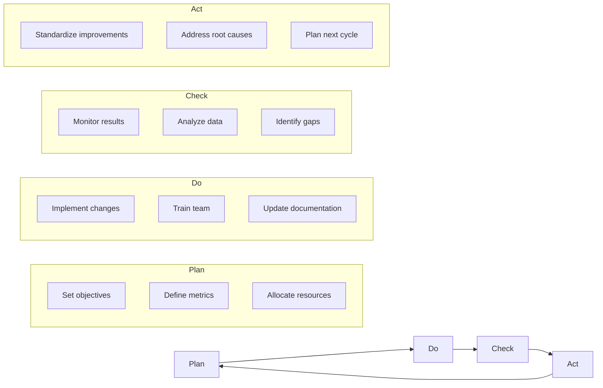
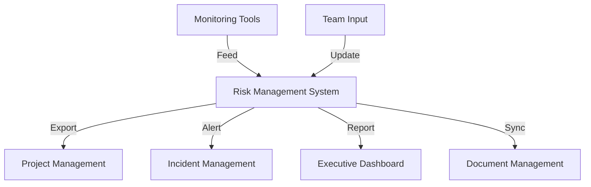

# Risk Monitoring Framework

## Table of Contents
1. [Introduction](#1-introduction)
2. [Monitoring Objectives](#2-monitoring-objectives)
3. [Key Performance Indicators](#3-key-performance-indicators)
4. [Reporting Structure](#4-reporting-structure)
5. [Review Process](#5-review-process)
6. [Continuous Improvement](#6-continuous-improvement)
7. [Tools & Systems](#7-tools--systems)
8. [Appendices](#8-appendices)

## 1. Introduction

This framework establishes a systematic approach to monitor and review risks throughout the Nuklei project lifecycle. It ensures that risk responses remain effective and aligned with project objectives.

### 1.1 Purpose
- Track risk mitigation effectiveness
- Identify emerging risks
- Ensure timely response to risk triggers
- Support data-driven decision making
- Maintain regulatory compliance

### 1.2 Scope
- All project phases (design, construction, operation, decommissioning)
- All risk categories (technical, schedule, cost, safety, etc.)
- All organizational levels (project team to executive leadership)

## 2. Monitoring Objectives

### 2.1 Primary Objectives
1. **Effectiveness**: Ensure risk responses achieve intended results
2. **Efficiency**: Optimize resource allocation for risk management
3. **Adaptability**: Respond to changing risk landscape
4. **Accountability**: Maintain clear ownership and responsibility
5. **Transparency**: Provide clear visibility into risk status

### 2.2 Monitoring Principles
- **Proactive**: Anticipate rather than react
- **Proportionate**: Scale monitoring to risk significance
- **Integrated**: Embed in regular project processes
- **Evidence-based**: Rely on objective data and metrics
- **Continuous**: Ongoing rather than periodic assessment

## 3. Key Performance Indicators

### 3.1 Risk Exposure Metrics

| KPI | Calculation | Target | Frequency | Owner |
|-----|------------|--------|-----------|-------|
| Risk Exposure | Σ(Risk Probability × Impact) | < 100 | Monthly | Risk Manager |
| Risk Reduction | (Initial Exposure - Current Exposure) / Initial Exposure | > 50% | Quarterly | Risk Manager |
| Mitigation Effectiveness | (Planned - Actual Impact) / Planned Impact | > 80% | Per Milestone | Project Manager |
| Response Time | Time from risk identification to mitigation | < 5 days | Per Risk | Risk Owner |
| Residual Risk | Remaining risk after mitigation | < 10% | Monthly | Risk Manager |

### 3.2 Risk Appetite Metrics

```mermaid
gauge
    title Risk Appetite Status
    axis 0,25,50,75,100
    "Current" : 35
    "Threshold" : 25
    "Target" : 15
```

## 4. Reporting Structure

### 4.1 Report Types

| Report | Audience | Frequency | Content |
|--------|----------|-----------|----------|
| **Executive Summary** | Senior Management | Monthly | High-level risk exposure, Top 5 risks, Strategic implications |
| **Operational Dashboard** | Project Team | Weekly | Risk status, Mitigation progress, Action items |
| **Technical Deep Dive** | Technical Leads | Bi-weekly | Technical risk analysis, Engineering solutions, Testing results |
| **Regulatory Compliance** | Regulators | Quarterly | Compliance status, Incidents, Corrective actions |
| **Stakeholder Update** | External Parties | As needed | Project status, Risk outlook, Mitigation plans |

### 4.2 Report Templates

#### 4.2.1 Executive Dashboard
```markdown
# Risk Management Dashboard
**Period**: [Date Range]  
**Prepared by**: [Name]  
**Date**: [Date]

## Risk Overview
- Total Risks: [Number]
- High/Extreme Risks: [Number]
- New Risks This Period: [Number]
- Risks Closed: [Number]
- Overall Risk Trend: [↑→↓]

## Top 5 Risks
1. **[Risk Name]** (Score: X) - [Status]
   - Impact: [Description]
   - Mitigation: [Actions]
   - Owner: [Name]
   - Next Steps: [Actions]

## Risk Exposure Trend
[Chart: Risk exposure over time]

## Key Actions & Decisions
- [ ] Action 1
- [ ] Action 2
- [ ] Action 3
```

## 5. Review Process

### 5.1 Review Meetings

| Meeting | Frequency | Participants | Duration | Focus |
|---------|-----------|--------------|----------|--------|
| **Risk Review Board** | Monthly | Project Leads, Risk Owners | 2 hours | Strategic risks, Major decisions |
| **Technical Risk Forum** | Bi-weekly | Technical Experts | 1.5 hours | Technical challenges, Solutions |
| **Daily Stand-up** | Daily | Project Team | 15 min | Immediate issues, Action tracking |
| **Lessons Learned** | Per Milestone | Cross-functional | 2 hours | Retrospective, Improvements |

### 5.2 Review Checklist

- [ ] All high/extreme risks reviewed
- [ ] Risk scores updated based on latest data
- [ ] Mitigation progress assessed
- [ ] New risks identified and assessed
- [ ] Risk owners confirmed
- [ ] Action items documented and assigned
- [ ] Follow-up dates scheduled

## 6. Continuous Improvement

### 6.1 Process Evaluation

| Area | Evaluation Criteria | Current Status | Improvement Actions |
|------|---------------------|----------------|----------------------|
| Risk Identification | Coverage, Timeliness | 75% | Implement automated monitoring |
| Risk Assessment | Accuracy, Consistency | 80% | Standardize scoring criteria |
| Risk Response | Effectiveness, Timeliness | 65% | Develop response playbooks |
| Monitoring | Frequency, Coverage | 70% | Enhance dashboard capabilities |
| Reporting | Clarity, Relevance | 85% | Customize for audience |

### 6.2 Improvement Cycle



## 7. Tools & Systems

### 7.1 Recommended Tools

| Tool Category | Example Tools | Purpose |
|--------------|---------------|----------|
| Risk Management | RiskWatch, LogicManager | Centralized risk register |
| Project Management | Jira, MS Project | Action tracking |
| Data Analytics | Power BI, Tableau | Risk visualization |
| Collaboration | Microsoft Teams, Slack | Team communication |
| Document Management | SharePoint, Confluence | Policy and procedure storage |

### 7.2 Integration Requirements



## 8. Appendices

### 8.1 Definitions
- **Key Risk Indicator (KRI)**: Metric providing early warning of increasing risk exposure
- **Key Control Indicator (KCI)**: Metric measuring effectiveness of risk controls
- **Risk Appetite**: Amount of risk an organization is willing to accept
- **Risk Tolerance**: Acceptable deviation from risk appetite
- **Risk Threshold**: Point at which action is required

### 8.2 References
- ISO 31000:2018 Risk Management
- COSO ERM Framework
- PMI Risk Management Professional (PMI-RMP) Guide
- NIST Risk Management Framework

### 8.3 Document History

| Version | Date | Author | Changes |
|---------|------|--------|----------|
| 1.0 | 2025-06-13 | Nuklei Team | Initial version |
| 1.1 | 2025-06-20 | Risk Team | Added monitoring tools section |
