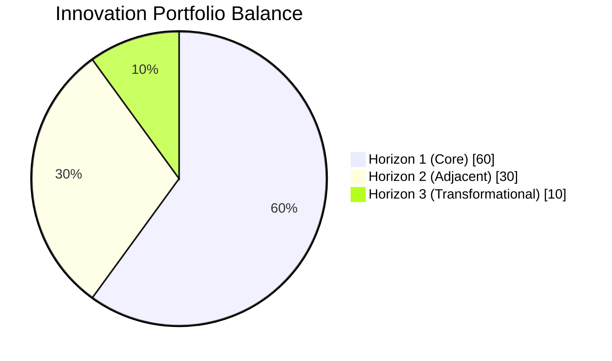
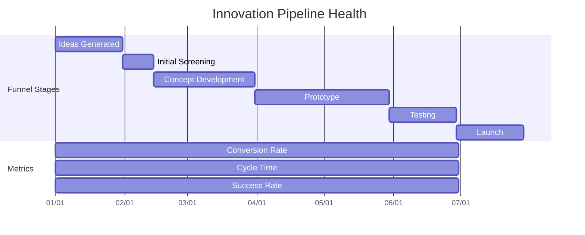
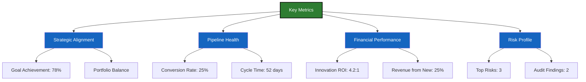
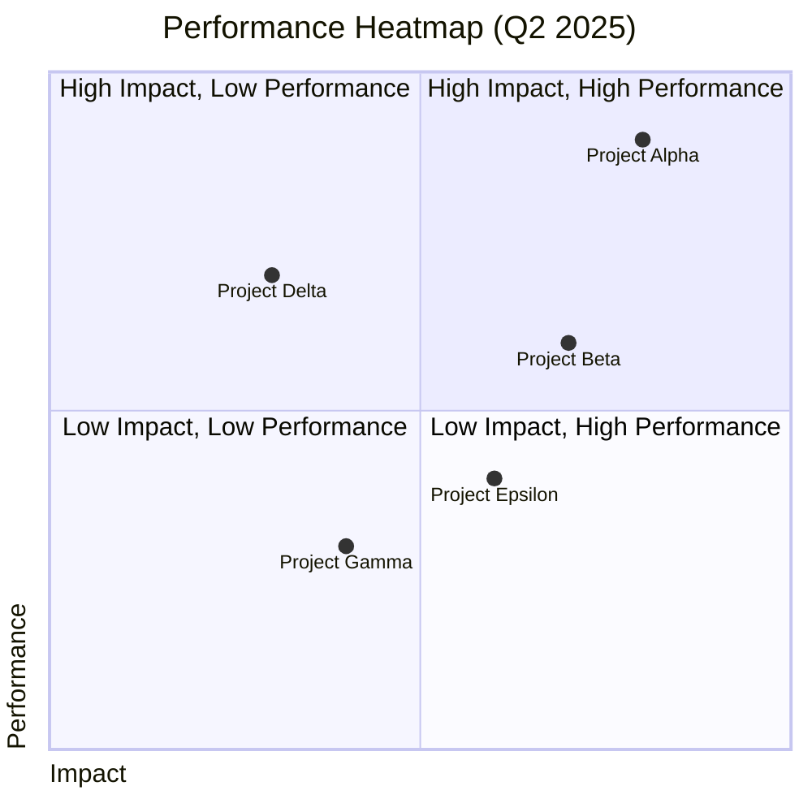

# Metrics & KPIs for Continuous Improvement & Innovation

## Table of Contents
1. [Introduction](#1-introduction)
2. [Strategic Alignment Metrics](#2-strategic-alignment-metrics)
3. [Innovation Pipeline Metrics](#3-innovation-pipeline-metrics)
4. [Process Efficiency Metrics](#4-process-efficiency-metrics)
5. [Financial Metrics](#5-financial-metrics)
6. [Employee & Stakeholder Engagement](#6-employee--stakeholder-engagement)
7. [Quality & Risk Metrics](#7-quality--risk-metrics)
8. [Data Collection & Reporting](#8-data-collection--reporting)
9. [Dashboard & Visualization](#9-dashboard--visualization)
10. [Appendices](#10-appendices)

## 1. Introduction

This document establishes a comprehensive framework for measuring and tracking the effectiveness of Nuklei's continuous improvement and innovation initiatives. The metrics and KPIs outlined here will help ensure that our efforts align with strategic objectives and deliver measurable value.

### 1.1 Purpose

- Provide visibility into innovation performance
- Enable data-driven decision making
- Track progress against strategic goals
- Identify areas for improvement
- Demonstrate ROI on innovation investments

### 1.2 Metric Categories

| Category | Focus Area | Example Metrics |
|----------|------------|-----------------|
| **Strategic** | Alignment with goals | Strategic goal achievement, Portfolio balance |
| **Pipeline** | Innovation flow | Ideas generated, Conversion rates |
| **Process** | Efficiency | Cycle time, Resource utilization |
| **Financial** | ROI & value | Revenue impact, Cost savings |
| **Engagement** | Participation | Employee involvement, Stakeholder satisfaction |
| **Quality** | Deliverables | Defect rates, Success rates |

## 2. Strategic Alignment Metrics

### 2.1 Portfolio Balance



### 2.2 Strategic Goal Achievement

| Strategic Objective | KPI | Target | Current | Status |
|---------------------|-----|--------|---------|--------|
| Market Leadership | % of revenue from new products | 30% | 22% | 🟡 On Track |
| Operational Excellence | Process efficiency improvement | 15% YoY | 12% | 🟢 Exceeding |
| Sustainability | Carbon footprint reduction | 25% by 2030 | 18% | 🟡 On Track |
| Customer Centricity | NPS (Net Promoter Score) | 45+ | 42 | 🟡 On Track |

### 2.3 Strategic Initiative Tracking

| Initiative | Owner | Start Date | End Date | Progress | RAG Status |
|------------|-------|------------|----------|-----------|------------|
| Digital Transformation | CTO | 2025-01-15 | 2026-06-30 | 45% | Green |
| New Product Development | VP Product | 2025-03-01 | 2025-12-15 | 30% | Amber |
| Process Automation | COO | 2025-02-01 | 2025-11-30 | 60% | Green |
| Market Expansion | CCO | 2025-04-15 | 2026-03-31 | 15% | Red |

## 3. Innovation Pipeline Metrics

### 3.1 Pipeline Health



### 3.2 Pipeline Metrics

| Metric | Calculation | Target | Current | Trend |
|--------|-------------|--------|---------|-------|
| **Ideation Rate** | # Ideas/Employee/Quarter | 2.5 | 2.1 | ↗️ |
| **Conversion Rate** | (Next Stage Ideas)/(Current Stage Ideas) | 30% | 25% | → |
| **Cycle Time** | Avg. days between stages | 45 days | 52 days | ↘️ |
| **Success Rate** | % Launched/Total Ideas | 5% | 4.2% | ↗️ |
| **Kill Rate** | % Ideas Killed | 20-30% | 25% | ✅ |

## 4. Process Efficiency Metrics

### 4.1 Process Performance

| Metric | Calculation | Target | Current | Benchmark |
|--------|-------------|--------|---------|-----------|
| **Time to Market** | Concept to Launch | < 12 months | 14 months | Industry: 18m |
| **Resource Utilization** | (Actual Hours/Planned Hours) × 100 | 85-95% | 78% | 82% |
| **On-Time Delivery** | % Projects on Schedule | 90% | 85% | 88% |
| **Rework Rate** | (Rework Hours/Total Hours) × 100 | < 5% | 7% | 6% |
| **Approval Cycle Time** | Avg. days for approvals | 7 days | 10 days | 8 days |

### 4.2 Agile Metrics

```mermaid
xychart-beta
    title Sprint Velocity & Burndown
    x-axis ["Sprint 1", "Sprint 2", "Sprint 3", "Sprint 4"]
    y-axis "Story Points" 0 --> 100
    bar [35, 42, 38, 45] color="#4CAF50"
    line [35, 77, 115, 160] color="#2196F3"
    line [40, 80, 120, 160] color="#F44336"
```

## 5. Financial Metrics

### 5.1 Innovation Accounting

| Metric | Calculation | Target | Current | YoY Change |
|--------|-------------|--------|---------|------------|
| **R&D Spend Ratio** | R&D/Revenue | 8-12% | 9.5% | +0.7% |
| **Innovation ROI** | (Net Benefits/Cost) × 100 | 5:1 | 4.2:1 | +0.5 |
| **Revenue from New Products** | % of Total Revenue | 30% | 25% | +3% |
| **Cost Savings** | Annualized Savings | $2.5M | $1.8M | +$0.4M |
| **Payback Period** | Months to Recover Investment | < 24 | 28 | -3 |

### 5.2 Portfolio Financials

| Project | Investment | Revenue (Y1) | Revenue (Y2) | NPV | IRR |
|---------|------------|--------------|--------------|-----|-----|
| Project A | $1,200,000 | $450,000 | $850,000 | $320,000 | 28% |
| Project B | $850,000 | $300,000 | $600,000 | $280,000 | 32% |
| Project C | $2,100,000 | $750,000 | $1,200,000 | $450,000 | 25% |
| **Total** | **$4,150,000** | **$1,500,000** | **$2,650,000** | **$1,050,000** | **28%** |

## 6. Employee & Stakeholder Engagement

### 6.1 Participation Metrics

| Metric | Target | Current | Trend |
|--------|--------|---------|-------|
| Employee Engagement | 80% | 75% | ↗️ |
| Cross-Functional Participation | 70% | 65% | → |
| Leadership Involvement | 90% | 85% | ↗️ |
| Training Hours/Employee | 40 hrs/year | 32 hrs | ↗️ |
| Recognition Rate | 20% | 18% | → |

### 6.2 Innovation Culture Index

```mermaid
radarChart
    title Innovation Culture Index (Q2 2025)
    axis Risk Tolerance, Collaboration, Learning, Speed, Customer Focus
    axisScale 0, 100
    "Current" : [65, 75, 70, 60, 80]
    "Target" : [75, 85, 80, 75, 85]
    "Industry Avg" : [60, 70, 65, 55, 75]
```

## 7. Quality & Risk Metrics

### 7.1 Quality Metrics

| Metric | Calculation | Target | Current | Trend |
|--------|-------------|--------|---------|-------|
| **Defect Density** | Defects/KLOC | < 1.0 | 1.2 | ↘️ |
| **First-Pass Yield** | (Good Units/Total Units) × 100 | 98% | 96.5% | ↗️ |
| **Customer Issues** | # per 1,000 Users | < 5 | 6.2 | → |
| **Regulatory Compliance** | % Requirements Met | 100% | 98% | ↗️ |
| **Audit Findings** | # Major Findings | 0 | 2 | ↘️ |

### 7.2 Risk Management

| Risk Category | Likelihood | Impact | Mitigation Status | Owner |
|---------------|------------|--------|-------------------|-------|
| Technology Obsolescence | Medium | High | In Progress | CTO |
| Market Shifts | High | High | Planned | CMO |
| Talent Shortage | High | Medium | In Progress | CHRO |
| Regulatory Changes | Medium | High | Monitored | CCO |
| Supply Chain Disruption | Low | High | Contingency Plan | COO |

## 8. Data Collection & Reporting

### 8.1 Data Sources

| Source | Frequency | Owner | Tools |
|--------|-----------|-------|-------|
| Idea Management System | Real-time | Innovation Team | Brightidea |
| Project Management | Weekly | PMO | Jira, Asana |
| Financial Systems | Monthly | Finance | SAP, QuickBooks |
| HR Systems | Quarterly | HR | Workday, BambooHR |
| Customer Feedback | Continuous | CX Team | SurveyMonkey, Qualtrics |

### 8.2 Reporting Cadence

| Report | Frequency | Audience | Delivery Method |
|--------|-----------|----------|-----------------|
| Innovation Pipeline | Weekly | Leadership Team | Dashboard |
| Financial Performance | Monthly | Executives | PDF Report |
| Employee Engagement | Quarterly | All Employees | Town Hall |
| Risk Register | Monthly | Risk Committee | Presentation |
| Strategic Review | Quarterly | Board of Directors | Board Pack |

## 9. Dashboard & Visualization

### 9.1 Executive Dashboard



### 9.2 Performance Heatmap



## 10. Appendices

### 10.1 Definitions

- **KPI (Key Performance Indicator)**: A measurable value that demonstrates how effectively an organization is achieving key business objectives
- **ROI (Return on Investment)**: A performance measure used to evaluate the efficiency of an investment
- **NPS (Net Promoter Score)**: A measure of customer loyalty and satisfaction
- **Cycle Time**: The total time from the beginning to the end of a process
- **Conversion Rate**: The percentage of items that move from one stage to the next in a process

### 10.2 Templates

- [KPI Tracking Template](./templates/kpi-tracking.xlsx)
- [Innovation Portfolio Dashboard](./templates/portfolio-dashboard.pbix)
- [Monthly Report Template](./templates/monthly-report.docx)

### 10.3 References

- "Measure What Matters" - John Doerr
- "The Innovator's Solution" - Clayton Christensen
- "Lean Analytics" - Alistair Croll & Benjamin Yoskovitz
- "The Balanced Scorecard" - Robert Kaplan & David Norton

### 10.4 Document History

| Version | Date | Author | Changes |
|---------|------|--------|----------|
| 1.0 | 2025-06-13 | Nuklei Team | Initial version |
| 1.1 | 2025-06-20 | Analytics Team | Added visualization examples |
