<!-- Nuklei Roadmap v0.4 -->
# Nuklei Roadmap  
*An open-source framework for the conception, licensing, construction, operation & decommissioning of peaceful nuclear research and power facilities*

> **Disclaimer**  
> This roadmap is strictly limited to peaceful civilian and scientific uses of nuclear technology in accordance with the Treaty on the Non-Proliferation of Nuclear Weapons (NPT) and IAEA Safety Standards. No part of this document may be used to design, develop, or manufacture nuclear weapons.
---

## 🚀 Executive Summary
This roadmap provides a comprehensive, legally compliant pathway for institutions seeking to harness nuclear technology for energy, medicine, and fundamental research. It blends internationally recognized safety standards with modern digital‑twin methodologies and an open‑source collaboration model.

### Core Objectives
- **Accelerate Deployment**: Reduce nuclear project timelines by 40% through standardized, open-source solutions
- **Enhance Safety**: Implement next-gen passive safety systems with 10x improved reliability
- **Reduce Costs**: Achieve 30% cost reduction through modular construction and digital twins
- **Ensure Security**: Develop cyber-resilient I&C systems with zero-trust architecture
- **Foster Innovation**: Create an open ecosystem for nuclear technology development

**Vision**: To establish a global standard for safe, sustainable, and accessible nuclear energy solutions through open collaboration and transparency.

## 🧭 Getting Started
This section helps new contributors and stakeholders quickly understand how to engage with the Nuklei project.

### Prerequisites
- Basic understanding of nuclear engineering principles
- Familiarity with open-source contribution workflows
- Access to relevant regulatory requirements in your jurisdiction

## 📚 Table of Contents
1. Strategic Vision & Objectives  
2. Regulatory & Legal Foundations  
3. Project Governance & Open‑Source Model  
4. Feasibility & Risk Assessment  
5. Site Selection & Environmental Integration  
6. Facility & Reactor Design  
            6.1 Reactor Technology Matrix  
            6.2 Core & Containment Architecture  
            6.3 Fuel Cycle & Supply Chain  
            6.4 Balance‑of‑Plant (BoP)  
7. Digital Instrumentation & Cybersecurity  
            7.1 I&C Platform Blueprint  
            7.2 Network Architecture & Zero‑Trust  
            7.3 Software Bill of Materials (SBOM)  
8. Safety Philosophy & Systems Engineering  
            8.1 Deterministic vs. Probabilistic Approaches  
            8.2 Passive Safety Mechanisms  
            8.3 Severe Accident Management  
9. Licensing Milestones & Compliance Audits  
10. Waste & Decommissioning Strategy  
            10.1 Front‑End Fuel Cycle  
            10.2 Back‑End & Advanced Recycling  
            10.3 Decommissioning Roadmap  
11. Human Capital & Training  
            11.1 Role‑Based Competency Map  
            11.2 Training Curriculum  
            11.3 Knowledge Management  
12. Simulation, Testing, and Digital Twins  
            12.1 Multi‑Physics Simulation Stack  
            12.2 Hardware‑in‑the‑Loop (HIL)  
            12.3 Data Analytics & AI‑OPS  
13. Community Engagement & Transparency  
14. Economics, Funding, & Business Models  
15. Project Phases, Timeline & Milestones  
16. Challenges, Risk Register & Mitigation  
17. Continuous Improvement & Innovation Cycles  

---

## 🔍 Detailed Technical Specifications

### 6.3 Fuel Cycle & Supply Chain

#### Key Technical Considerations
- **Sustainability**: 
  - Target burnup > 100 GWd/tHM for LWR fuels
  - Achieve >95% TRISO particle integrity at 1600°C
  - Implement multi-recycling of actinides to reduce waste volume by 80%
  
- **Security**:
  - Implement IAEA INFCIRC/225/Rev.6 for physical protection
  - Deploy tamper-evident seals with 99.99% detection probability
  - Use active neutron interrogation for spent fuel verification (1% U-235 detection threshold)

- **Resilience**:
  - Maintain 6-month strategic reserve of critical components
  - Qualify 3+ suppliers for all safety-class components
  - Implement blockchain-based supply chain tracking with cryptographic verification

#### Technology Roadmap
| Timeframe | Development Focus | Key Technical Milestones |
|-----------|-------------------|---------------------------|
| 2025-2027 | Fuel cycle R&D | 
  - Complete TRISO fuel qualification to 1800°C
  - Achieve 5% fissile utilization in fast spectrum
  - Qualify accident-tolerant fuel coatings (CrN, TiAlN)
  |
| 2027-2030 | Pilot deployment | 
  - First 100kg batch of HALEU (19.75% U-235)
  - Demonstrate 95% TRU recovery in pyroprocessing
  - Qualify 3D-printed fuel assembly components (ASTM F42 standards)
  |
| 2030+ | Full deployment | 
  - Achieve <1% losses in U/Pu recovery
  - Implement AI-driven fuel cycle optimization
  - Deploy closed fuel cycle with <1% waste-to-repository
  |

### 6.3 Fuel Cycle & Supply Chain
| Stage | Technology Option | Enrichment/Fabrication | Key Suppliers | Open‑Source Tools |
|-------|------------------|------------------------|---------------|-------------------|
| Front‑End | SWU Enrichment | Centrifuge – ≤5 % LEU | Urenco, TENEX | **Open‑EPIC** (cascade modelling) |
| Fuel Fabrication | PWR Pellets / TRISO / Salt | Pellet press / TRISO coater / LiF‑ThF₄ batching | Framatome, X‑Energy | **SaltProc** (online reprocessing sim) |
| Back‑End | Spent Fuel Storage | Wet Pool → Dry Cask | Holtec, Orano | **SERPENT‑SF** (decay calc) |
| Advanced Recycling | Pyroprocessing / Voloxidation | Metal fuel electrorefiner | KAERI, INL | **PyReL** (electrorefining) |

**Supply‑Chain Resilience Measures**  
* Dual‑sourcing for nuclear‑grade zirconium and nickel alloys.  
* Additive‑manufactured core internals (qualified via ASME BPVC Section III Case N‑834).  
* Blockchain‑based provenance for critical components.

### 6.4 Balance‑of‑Plant (BoP)

#### Turbine Island
- **Supercritical CO₂ Brayton Cycle**
  - Operating conditions: 550°C @ 25 MPa
  - Target efficiency: >50% (vs. 33% for Rankine)
  - Turbomachinery: Magnetic bearings, 45,000 RPM operation
  - Heat rejection: 35°C cooling water return (dry cooling compatible)

- **Rankine Steam Cycle (Alternative)**
  - Ultra-supercritical steam: 650°C @ 30 MPa
  - 7-stage feedwater heating with 1.05 terminal difference
  - Condenser vacuum: 2.5 kPa(a)

#### Heat Exchangers
| Type | Heat Transfer Coeff. (W/m²K) | Pressure Drop (kPa) | Compactness (m²/m³) |
|------|----------------------------|---------------------|---------------------|
| Printed-Circuit | 15,000 | 50 | 2,500 |
| Helical-Coil | 8,000 | 30 | 1,200 |
| Shell & Tube | 3,000 | 20 | 200 |

**Materials:** Alloy 617M (ASME Code Case 2702) for high-temperature service

#### Auxiliary Systems
- **Black-Start Capability**
  - 2 × 5 MWe aeroderivative gas turbines (30s start)
  - 20 MWh Li-ion battery storage (10C discharge)
  - Island-mode synchronization <1% voltage/frequency deviation

- **Cooling Systems**
  - Passive decay heat removal (72h grace period)
  - Seismic-qualified cooling towers (PGA 0.3g)
  - Hybrid wet/dry cooling with <2% thermal penalty

### 7.1 I&C Platform Blueprint

#### System Architecture
- **Hardware Platform**
  - Processor: RISC-V multicore (SIL-3 certified)
  - Redundancy: 2-out-of-4 voting architecture
  - MTBF: >250,000 hours
  - Operating Environment: -40°C to +70°C ambient

| Layer | Function | Technical Specifications | Safety Class |
|-------|----------|--------------------------|--------------|
| **HMI** | Operator workstations | 
  - 4K multi-touch displays (IEC 62366 compliant)
  - 99.999% availability
  - <200ms response time | Non‑safety |
| **Control Logic** | Safety systems | 
  - RISC‑V SIL‑3 SoC @ 1.5 GHz
  - Dual-core lockstep
  - 4GB ECC RAM | Safety (1E) |
| **Field Bus** | Sensor network | 
  - TSN (IEEE 802.1Qbv)
  - 1 Gbps fiber optic
  - <100μs jitter | Safety |
| **Sensors** | Process monitoring | 
  - Self-diagnosing FPGAs (Xilinx Zynq Ultrascale+)
  - ±0.1% accuracy
  - 24-bit ADC resolution | Safety |

#### Performance Metrics
- **Response Time**: <50ms for safety-critical functions
- **Data Integrity**: 128-bit AES encryption with HMAC-SHA256
- **Update Rate**: 100Hz for safety systems, 10Hz for non-critical
- **Certification**: IEC 61508 SIL-3, IEC 60880 Class 2

#### Development Tools
- **Model-Based Development**: MATLAB/Simulink with DO-178C toolchain
- **Verification**: Formal methods (TLA+, Coq)
- **Testing**: Hardware-in-the-loop (HIL) with 95% MC/DC coverage

### 7.2 Network Architecture & Zero‑Trust

#### Network Segmentation
- **Purple-Box Architecture**
  - **Red Zone**: External-facing (DMZ)
  - **Purple Zone**: Nuclear OT network (IEC 62443-3-3)
  - **Blue Zone**: Enterprise IT
  - **Black Zone**: Safety systems (air-gapped)

| Security Control | Implementation | Performance Impact |
|-----------------|----------------|--------------------|
| **Data Diodes** | Optical gap, 10Gbps throughput | <50μs latency |
| **MACsec** | AES-256 encryption | <10μs per hop |
| **Network Taps** | 100% traffic mirroring | Zero packet loss |

#### Zero Trust Implementation
1. **Identity Verification**
   - Hardware PUF tokens (FIPS 140-3 Level 3)
   - Multi-factor authentication (FIDO2 + biometrics)
   - Continuous authentication (behavioral biometrics)

2. **Microsegmentation**
   - Software-defined perimeters (SDP)
   - mTLS with 2048-bit RSA/256-bit ECC
   - Flow-based access control (IEC 62351-7)

3. **Threat Detection**
   - eBPF-based DPI (L2-L7 inspection)
   - 100Gbps wire-speed analysis
   - ML-based anomaly detection (99.9% accuracy)

#### Security Monitoring
- **SIEM Integration**
  - Splunk Enterprise Security
  - 90-day hot storage
  - 1-year warm storage
- **Threat Intelligence**
  - STIX/TAXII 2.1 feeds
  - Automated IOC updates (15-min refresh)
- **Incident Response**
  - Automated playbooks (SOAR)
  - 5-minute MTTR for critical alerts

### 7.3 Software Bill of Materials (SBOM)
- SPDX 3.0 compliant SBOM generated via **Syft**.  
- Signed with in‑toto attestations.  
- Continuous vulnerability feed via **Trivy‑Operator**.

### 8.2 Passive Safety Mechanisms – Technical Specifications

#### Core Cooling Systems
| Mechanism | Performance Parameters | Design Basis | Redundancy | Verification Method |
|-----------|------------------------|--------------|------------|---------------------|
| Natural Circulation DHR | 
  - Heat removal: 2% FP
  - ΔT: 50°C
  - Flow: 1.5 m/s | 
  - LOCA, SBO
  - 72h autonomy | 4×100% trains | 
  - RELAP-3D
  - GOTHIC 8.3 |
| Decay-Heat Chimney |
  - 10 MW thermal
  - 800°C max temp
  - 100% passive | 
  - Beyond DBA
  - No AC power | 3×50% trains |
  - CFD (STAR-CCM+)
  - High-temperature testing |

#### Core Catastrophe Prevention
| System | Activation Criteria | Response Time | Materials | Performance |
|--------|---------------------|---------------|-----------|--------------|
| Core Catcher | 
  - Vessel temp >1200°C
  - Corium detection | <60s | 
  - ZrO₂ sacrificial layer
  - FeCrAl structural | 
  - 100t corium retention
  - 50m² heat exchange |
| Freeze Plug | 
  - Power loss
  - Overtemp 750°C | 120-300s | 
  - FLiNaK salt
  - Inconel 718 | 
  - 99.99% reliability
  - Self-diagnostic |

#### Safety Analysis
- **Deterministic Analysis**
  - Maximum Credible Accident (MCA) approach
  - Single Failure Criterion applied
  - 1.5× design margin on all safety systems

- **Probabilistic Risk Assessment**
  - Core damage frequency: <1E-7/ry
  - Large release frequency: <1E-8/ry
  - Seismic margin: 1.67× DBE

#### Testing & Validation
1. **Thermal-Hydraulic**
   - Integral Test Facility (1:5 scale)
   - 10,000+ hours of test data
   - OECD/NEA validation matrix

2. **Materials Testing**
   - 5,000+ specimens under irradiation
   - PIE at hot cells (60+ dpa)
   - Creep-fatigue testing to 100,000h

3. **Cybersecurity**
   - Penetration testing (OWASP Top 10)
   - Fuzzing of safety-critical firmware
   - Red team exercises (annual)

### 10.2 Back‑End & Advanced Recycling

#### 1. PUREX Process Baseline
- **Chemical Flow**
  - Dissolution: 6M HNO₃, 90°C
  - Extraction: 30% TBP/kerosene
  - Partitioning: U/Pu/Np separation
- **Performance**
  - U recovery: >99.9%
  - Pu recovery: >99.75%
  - Decontamination factor: 10⁶-10⁷
- **Waste Streams**
  - HLW: 0.5 m³/tonne HM
  - ILW: 2.0 m³/tonne HM

#### 2. Advanced Partitioning (UREX+/TRUEX)
- **Process Parameters**
  - Solvent: 0.2M TODGA + 5% TBP
  - Centrifugal contactors (10,000g)
  - Temperature: 45±2°C
- **Recovery Rates**
  - TRU: >99.9%
  - Tc-99: >99%
  - I-129: >99.5%
- **Waste Reduction**
  - HLW volume: 85% reduction
  - Heat load: 95% reduction

#### 3. Pyroprocessing (Metal Fuels)
| Step | Conditions | Materials | Efficiency |
|------|------------|-----------|------------|
| Anode | U-Pu-Zr alloy | - | 99.9% U/Pu |
| Cathode | Solid cathode | Steel | 99.5% U |
| Electrolyte | LiCl-KCl | 500°C | 99.9% purity |
| Salt Treatment | Zeolite columns | - | 99% salt recycle |

#### 4. MSR Online Processing
- **Off-Gas System**
  - Noble metal removal: Hg scrubbers (99.9% efficiency)
  - Kr/Xe capture: Cryogenic distillation
  - Tritium management: Permeation membranes
- **Salt Purification**
  - Redox control: H₂/HF sparging
  - Fission product removal: Electrochemical pumps
  - Salt quality: <1ppm impurities
- **Robotics**
  - 6-axis manipulators (10μm precision)
  - Force feedback: 0.1N resolution
  - MTBF: 50,000 hours

#### 5. Waste Conditioning
- **Glass Ceramic Waste Forms**
  - Composition: 30% HLW + 70% glass former
  - Leach rate: 10⁻⁶ g/cm²·day (MCC-1 test)
  - Thermal stability: 1,200°C
- **Storage Requirements**
  - Dry cask: 100 years
  - Geological repository: >100,000 years
  - Monitoring: Distributed fiber optics

### 11.2 Training Curriculum (Excerpt)
| Module | Hours | Format | Tooling |
|--------|-------|--------|---------|
| Reactor Theory | 80 | Lectures + OpenMC labs | JupyterHub cluster |
| I&C Systems | 60 | Hands‑on FPGA kits | Verilator, Zephyr RTOS |
| Severe Accident Mgmt | 40 | VR scenario sim | Unity‑3D headset |
| Regulatory Affairs | 30 | Case studies | IAEA e‑learning |

### 12.1 Multi‑Physics Simulation Stack

```mermaid
graph TD
  neutronics(OpenMC) --> coupling
  thermo(MOOSE/RELAP‑7) --> coupling
  CFD(nek5000) --> coupling
  coupling(Coupled Solver) --> twin(Digital Twin DB)
  twin --> dashboard(Realtime Ops Dashboard)
```

### 14. Cost Breakdown Example – 300 MWe SMR (USD 2025)
| Category | %CAPEX | Cost (M$) | Notes |
|----------|--------|-----------|-------|
| Reactor Island | 32 % | 480 | Factory‑built modules |
| Turbine Island | 24 % | 360 | sCO₂ cycle |
| Electrical Systems | 8 % | 120 | Switchyard, transformer |
| I&C + Cybersecurity | 6 % | 90 | Safety‑class PLCs |
| Licensing & QA | 5 % | 75 | Regulator fees, audits |
| EPC Services | 10 % | 150 | Site prep, logistics |
| Contingency | 15 % | 225 | 25 % owner‑controlled |
| **Total** | 100 % | **1 500** | 5 000 $/kWe |

## 🔍 Risk Management Framework

### 17. Risk Register (Expanded)

#### Risk Assessment Methodology
- **Qualitative Analysis**: Expert judgment and historical data
- **Quantitative Analysis**: Probabilistic risk assessment (PRA)
- **Mitigation Strategies**: Defense-in-depth approach

#### Risk Monitoring
- Real-time risk dashboards
- Automated alerts for risk threshold breaches
- Quarterly risk review meetings
| # | Risk | Likelihood | Impact | Detection | Mitigation |
|---|------|-----------|--------|-----------|-----------|
| 1 | Supply‑chain delays | Med | High | Schedule KPI drift | Local fabrication JV |
| 2 | Regulatory changes | Low | High | Regulatory scanning | Adaptive licensing plan |
| 3 | Public opposition | Med | Med | Sentiment analysis | Community benefits fund |
| 4 | Cyber intrusion | Med | High | SOC alerts | Zero‑trust + SBOM |
| 5 | Seismic event | Low | High | Seismic monitors | Base isolators + drills |
| 6 | Tritium permeation (fusion) | Med | Med | Blanket sampling | SiC coatings |

